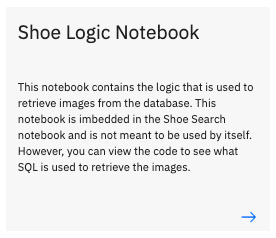

# Db2 and Vector Comparisons

The watsonx.data and Milvus includes a Db2 database that demonstrates how vector can be used in a traditional database engine. The Db2 database is loaded with images from a shoe dataset.

UT Zappos50K (UT-Zap50K) is a large shoe dataset consisting of 50,025 catalog images collected from Zappos.com. The images are divided into 4 major categories — shoes, sandals, slippers, and boots — followed by functional types and individual brands. Details of this dataset and credits are found at the bottom of this section.

The following section provides some details of the Db2 vector capability. Note that these features may not yet be available for use as this code is part of a fix pack release of Db2.

## Db2 Vector Support

Db2 12.1 introduces a series of vector functions that provide support for searching data based on vector comparisons. Some usage includes:

   * GenAI:
 
      * LLMs/RAG
   
   * Financial:
    
      * Fraud detection 
      * Credit risk assessment
    
   * Retail:
    
      * Product recommendation
      * Customer segmentation
   
   * Manufacturing:
    
      * Anomaly detection
      * Visual inspection
    
   * Government:
    
      * Crime analysis
      * Document similarity analysis
    
   * Healthcare:
    
      * Personalized medicine
      * Medical diagnosis

Vector support includes a new vector type, vector distance functions, and helper functions.

### VECTOR type
* VECTOR(dimensions, type)
* FLOAT32 and INT8 vectors
* Maximum dimension: 8168 (FLOAT 32), 32672 (INT8)

Example:
```
CREATE TABLE VTABLE (RV VECTOR(100, REAL), IV VECTOR(300, INT8))
```

### VECTOR distance function
* VECTOR_DISTANCE(vector_1, vector_2, function)
* Metrics: COSINE, EUCLIDEAN, EUCLIDEAN_SQUARED, DOT, HAMMING, MANHATTAN

Example:
```
VECTOR_DISTANCE(vector1, vector2, COSINE)
```

### Helper Functions
* Constructor – string to vector typee.g., VECTOR('[-0.0762727, 0.0559632]', REAL) 
* Vector serializing – vector type to stringe.g., VECTOR_SERIALIZE(vector1) 
* Vector dimension – counting elementse.g., VECTOR_DIMENSION_COUNT(vector1)

## Db2 Vector Example

The watsonx.data and Milvus system includes a link to a series of Jupyter notebooks that demonstrate how vectors can be used in Db2. In your reservation, you should see a series of ports that are used to access the components in the system.


Click on the Db2 Vector Demonstration link and if prompted, enter the password `watsonx.data`. 

Your browser should display the Table of Contents screen.


If you are not familiar with Jupyter notebooks, or the use of the Python language, click on the arrow inside the description to open a separate browser screen on the topic. The Introduction to Jupyter Notebooks is shown:


The three notebooks at the bottom of the screen contain the code to demonstrate the use of vectors in Db2.


## Create the Shoe Catalog

The first notebook is used to create the table that will be used by the vector search logic.


Follow the instructions inside the notebook to generate the `SHOE_CATALOG` and `SHOE_IMAGES` tables.

```sql
CREATE TABLE SHOE_CATALOG
  (
  ID            INT              NOT NULL GENERATED ALWAYS AS IDENTITY,
  TYPE          VARCHAR(32)      NOT NULL,
  SUBTYPE       VARCHAR(32)      NOT NULL,
  BRAND         VARCHAR(64)      NOT NULL,
  LINE          VARCHAR(32)      NOT NULL,
  CODE          VARCHAR(32)      NOT NULL,
  PHASH         CHAR(32)
  ) ORGANIZE BY ROW;

CREATE TABLE SHOE_IMAGES
  (
  ID            INT              NOT NULL GENERATED ALWAYS AS IDENTITY,
  IMAGE         VARBINARY(28000)
  ) ORGANIZE BY ROW;
```

The table contains the following information:

  * ID - a unique identifier for the record
  * TYPE - the type of shoe. There are four catagories of shoes (Boots, Sandals, Shoes, Slippers)
  * SUBTYPE - A further classification of the type of shoe. The subtypes are specific to the type of shoe. For instance, for Slippers there are Slipper Flats, Slipper Heels, and Boots. There is a type of slipper called Boots, instead of a Boot which is a slipper!
  * BRAND - The manufacturer of the shoe
  * LINE - There may be multiple versions of a shoe (color) and these shoes will have the same LINE number
  * CODE - The unique catalog identifier for the shoe
  * PHASH - A vector that is used to create a unique signature of the picture based on color separation

The SHOE_IMAGES table contains the original image of the shoe. This table is separate from the catalog table to improve response times.

  * ID - The same identifier as the catalog table above
  * IMAGE - A binary copy of the image

Once the tables have been created, the program will load the tables with the 50,000 shoe images and generate indexes for them. The table creation will take a few minutes as many images are being read and vectors being created for each one. 

## Shoe Logic Notebook



The Shoe Logic Notebook contains code to search the images for similar values. You do not need to run any of the code that is found inside this notebook. The notebook will be loaded by the Shoe Search notebook. 

There are two functions (`similar` and `shoe`) that are used to retrieve the shoe images from Db2. The `similar` function contains SQL that compares image vectors using a `compare` function.

```sql
SELECT CAT.id, CAT.brand, CAT.code, IMAGES.image, 
       compare(:shoe_phash,cat.phash,'both') 
  FROM 
     SHOE_CATALOG CAT, SHOE_IMAGES IMAGES
  WHERE 
      compare(:shoe_phash,cat.phash,'both') <= :hash_diff
      AND IMAGES.id = CAT.id
      AND CAT.TYPE = :shoe_type 
      AND CAT.SUBTYPE = :shoe_subtype    
ORDER BY 5 ASC
FETCH FIRST 20 ROWS ONLY 
```

The compare function is a C routine that was cataloged in Db2 and is used to check the distance between the two vectors. The Db2 12.1 vector functions are not publically available at the time of publication, so this code was created to simulate the Db2 vector functions. The full code can be found at the bottom of this section.

## Shoe Search 

The `Shoe Search` notebook is used to explore the shoes that are stored in Db2.


The notebook will take you through several examples including:

  * How to view the brands, shoe types, and total shoe count
  * How to view "similar" shoes using vectors
  * Restrict shoe selection based on vendor, shoe type and subtypes
  * Change the maximum vector distance for comparisons

You can explore the entire collection of shoes using your own favorite shoe brands!

## Credits 

### Shoe Data

UT Zappos50K is a large shoe dataset consisting of 50,025 catalog images 
collected from Zappos.com. The images are divided into 4 major categories — shoes, sandals, slippers, and boots — followed by functional types and individual brands. This dataset is created in the context of an online shopping task, where users care specifically about fine-grained visual 
differences. The images are mostly 136 x 102 pixels. The shoes are centered on a white background and pictured in the same orientation for convenient analysis.

The data was based on 2014 images. The vendors, products, and shoes may no longer exist.

Reference: [https://www.cs.utexas.edu/~grauman/papers/yu-cvpr2014.pdf](https://www.cs.utexas.edu/~grauman/papers/yu-cvpr2014.pdf)

### Python Libraries

The vector function used by the system is based on the [ImageHash library](https://pypi.org/project/ImageHash/). See also [Johannes Buchner's](https://github.com/JohannesBuchner/imagehash) Github project.


### Db2 Vector Function

```c
/****************************************************************************
** (c) Copyright IBM Corp. 2025 All rights reserved.
** 
** The following sample of source code ("Sample") is owned by International 
** Business Machines Corporation or one of its subsidiaries ("IBM") and is 
** copyrighted and licensed, not sold. You may use, copy, modify, and 
** distribute the Sample in any form without payment to IBM, for the purpose of 
** assisting you in the development of your applications.
** 
** The Sample code is provided to you on an "AS IS" basis, without warranty of 
** any kind. IBM HEREBY EXPRESSLY DISCLAIMS ALL WARRANTIES, EITHER EXPRESS OR 
** IMPLIED, INCLUDING, BUT NOT LIMITED TO, THE IMPLIED WARRANTIES OF 
** MERCHANTABILITY AND FITNESS FOR A PARTICULAR PURPOSE. Some jurisdictions do 
** not allow for the exclusion or limitation of implied warranties, so the above 
** limitations or exclusions may not apply to you. IBM shall not be liable for 
** any damages you suffer as a result of using, copying, modifying or 
** distributing the Sample, even if IBM has been advised of the possibility of 
** such damages.
*****************************************************************************
**
** SOURCE FILE NAME: compare.c
**
** Compares two strings and returns the HAMMING distance between the two as an
** integer.
*****************************************************************************/

#include <stdio.h>
#include <string.h>
#include <stdlib.h>
#include <sqlca.h>
#include <sqludf.h>
#include <ctype.h>
#include "sqlsystm.h"
#define uchar unsigned char
#define bool int
#define true 1
#define false 0

/* Hamming distance at the byte level */

void SQL_API_FN compare(SQLUDF_CHAR    *phash1,
                        SQLUDF_CHAR    *phash2,
                        SQLUDF_CHAR    *comparison,
                        SQLUDF_INTEGER *hamming,
                        SQLUDF_NULLIND *phash1NullInd,
                        SQLUDF_NULLIND *phash2NullInd,
                        SQLUDF_NULLIND *comparisonNullInd,
                        SQLUDF_NULLIND *hammingNullInd,
                        SQLUDF_TRAIL_ARGS)

{

int static diff[16][16] = 
  {{0,1,1,2,1,2,2,3,1,2,2,3,2,3,3,4},
   {1,0,2,1,2,1,3,2,2,1,3,2,3,2,4,3},
   {1,2,0,1,2,3,1,2,2,3,1,2,3,4,2,3},
   {2,1,1,0,3,2,2,1,3,2,2,1,4,3,3,2},
   {1,2,2,3,0,1,1,2,2,3,3,4,1,2,2,3},
   {2,1,3,2,1,0,2,1,3,2,4,3,2,1,3,2},
   {2,3,1,2,1,2,0,1,3,4,2,3,2,3,1,2},
   {3,2,2,1,2,1,1,0,4,3,3,2,3,2,2,1},
   {1,2,2,3,2,3,3,4,0,1,1,2,1,2,2,3},
   {2,1,3,2,3,2,4,3,1,0,2,1,2,1,3,2},
   {2,3,1,2,3,4,2,3,1,2,0,1,2,3,1,2},
   {3,2,2,1,4,3,3,2,2,1,1,0,3,2,2,1},
   {2,3,3,4,1,2,2,3,1,2,2,3,0,1,1,2},
   {3,2,4,3,2,1,3,2,2,1,3,2,1,0,2,1},
   {3,4,2,3,2,3,1,2,2,3,1,2,1,2,0,1},
   {4,3,3,2,3,2,2,1,3,2,2,1,2,1,1,0}};

int diff_count = 0;
int ham_error = 99999999;
int i, ich1, ich2, start_byte, end_byte;
uchar ch1, ch2;
bool invalid_data = false;

  /* Check to see if either of the values are null */

  if (*phash1NullInd == -1 || *phash2NullInd == -1)
    {
      *hammingNullInd = -1;
      *hamming = ham_error;
      return;
    }

  /* Check to make that the strings that you sent me are 32 bytes long */

  if (strlen(phash1) != 32 && strlen(phash2) != 32)
    {
      *hamming = ham_error;
      return;
    } 

  /* Default is to search the entire HASH code */

  start_byte = 0;
  end_byte = 31;

  /* Check to see if you want  ROW or COLUMN specific */

  if (*comparisonNullInd != -1)
    {
      /* First half of the hash code is the row */
      if (toupper(comparison[0]) == 'R') /* Row */
        {
          start_byte = 0;
          end_byte = 15;
        }
      else
        {
          /* Second half of the hash code is the column */
          if (toupper(comparison[0]) == 'C') /* Column */
            {
              start_byte = 16;
              end_byte = 31;
            }
        }
    }

  /* Check and compare each character to get the hamming distance */

  for (i = start_byte; i <= end_byte; ++i) 
    {
      if (invalid_data == true) break;

      ch1 = toupper(phash1[i]);
      ch2 = toupper(phash2[i]);
   
      if (ch1 >= 'A' && ch1 <= 'F') 
        {
          ich1 = ch1 - 'A' + 10;
        } 
      else 
        {
          if (ch1 >= '0' && ch1 <= '9') 
            {
              ich1 = ch1 - '0';
            }
          else 
            {
              invalid_data = true;
            }
        }
      if (ch2 >= 'A' && ch2 <= 'F') 
        {
          ich2 = ch2 - 'A' + 10;
        } 
      else 
        { 
          if (ch2 >= '0' && ch2 <= '9') 
            {
              ich2 = ch2 - '0';
            } 
          else 
            {
              invalid_data = true;
            }
        }
      if (invalid_data == false) 
        {
          diff_count += diff[ich1][ich2];
        }
    }


  if (invalid_data == false) 
    {
      *hamming = diff_count;
    }
  else
    {
      *hamming = ham_error;
    }
} 
```