# Diagnostics

You usually end up in the Diagnostics section because something went wrong with your server. Hopefully one of the sections below will help solve the problem that you are having.

There are 13 sections in the diagnostics screen. These sections cover the following topics:

* [Check Presto Connection](#check-presto-connection)
* [Check watsonx.data System](#check-watsonxdata-system)
* [Restart Presto](#restart-presto)
* [Restart watsonx.data](#restart-watsonxdata)
* [Restart LLM Service](#restart-llm-service)
* [Passwords](#passwords)
* [Certificates](#certificates)
* [Upload files](#upload-file)
* [Download file](#download-file)
* [Rebuild Database](#rebuild-database)
* [Add Library](#add-library)
* [Update Software](#update-software)
* [Restart Application](#restart-application)

## Check Presto Connection

Press the ++"Check Connection"++ button to determine if a connection can be established with the watsonx.data system. The system will either tell you that the connection is okay, or that the connection timed out.

If the connection timed out, you will need to move on to the next step and check if the watsonx.data system is running.

## Check watsonx.data System

If your connection failed (hint, see button above) then something may be wrong with the Presto engine or watsonx.data. You can check to see what services are up and running in our server by pressing the ++"Check Services"++ button.

 If you find that the Presto instance is missing, restart Presto. If more than one service is missing you will need to restart the watsonx.data services.

## Restart Presto

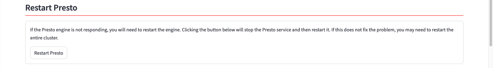

If you've determined that the Presto service is down, you can use this section to shut down and restart Presto. Press the ++"Restart Presto"++ button to begin the process.

The display will show a progress indicator that tracks the Presto startup process. Note that this can take a few minutes to complete. The system will display a success message when the startup has completed.

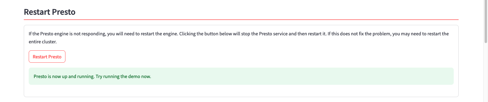

## Restart watsonx.data

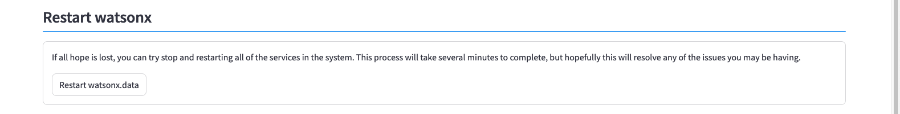

If nothing seems to work (or mote than one service is stopped), you can try stop and restarting all services in the system. This process will take several minutes to complete, but hopefully this will resolve any of the issues you may be having.

Start the process by clicking the ++"Restart watsonx.data"++ button. This process will display multiple messages as it stops and starts services.

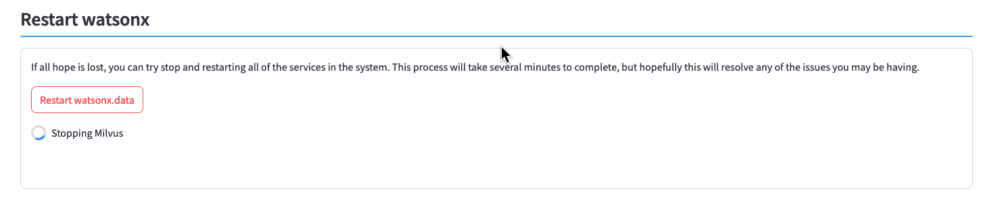

Restarting the watsonx.data services will take several minutes, as will the startup for Presto. Once the process is complete, you should see a successful completion message.

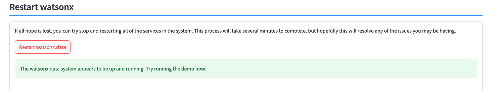

## Restart LLM Service

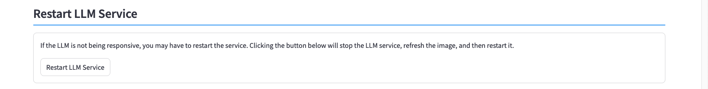

If the LLM is not being responsive, you may have to restart the service. Clicking the ++"Restart LLM Service"++ button will stop the LLM service, refresh the image, and then restart it.

You may want to restart the service if you come across an error loading an LLM which indicates that the LLM manager is out of date. The can occur when an LLM has features which are not currently supported in the LLM manager. Restarting the LLM manager will automatically refresh the image to the latest version available.

## Passwords

The password section displays all the Userids and passwords used in the watsonx.data system.

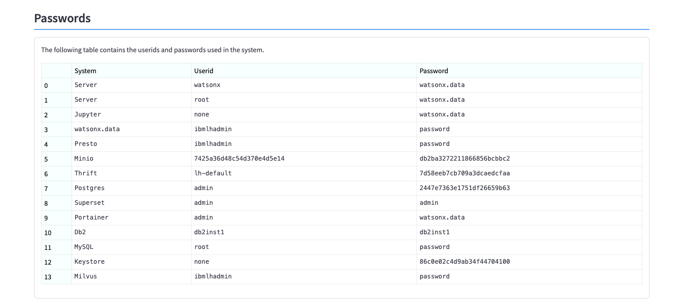

## Certificates

You can use any of the buttons below to download certificates used to connect to watsonx.data. 

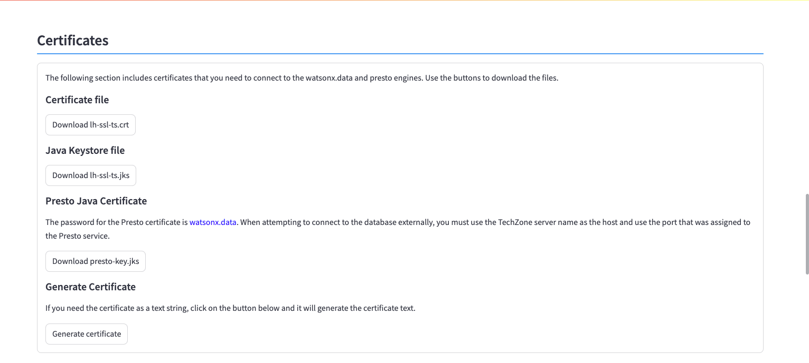

If you want to generate the certificate to "cut and paste" the value into an application, use the Generate Certificate button.

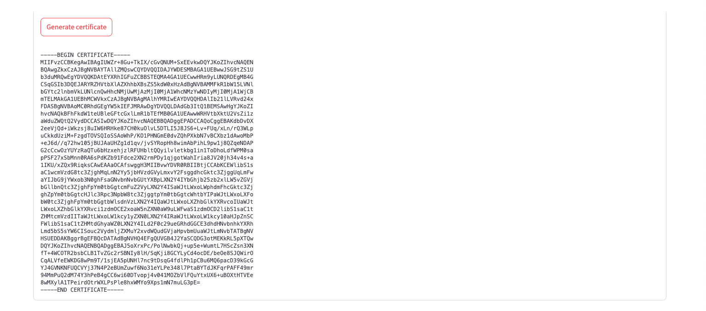

## Upload File

If you need to upload files into the system, drag and drop the files onto this dialog, or select the files using the local file manager. Note that there is a limit to the file size (2Gb). The dialog will display the file size limit.

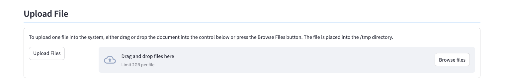

## Download File

You can download a file from the image by using this dialog. There are two steps involved. First enter the name of the file in the dialog and press the Check File button. 

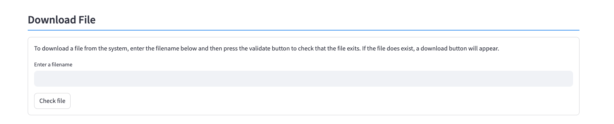

If the file can be found on the system, it will generate a link to that file. For instance, the following displays the download link that is generated when requesting the `presto-key.jks` file which is found in the `/certs` directory.

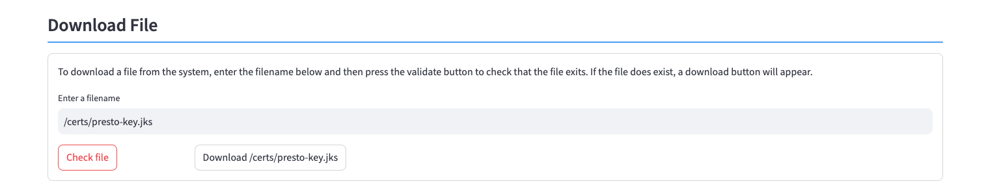

You can download the file using the `Download` button that generated.

## Rebuild Database

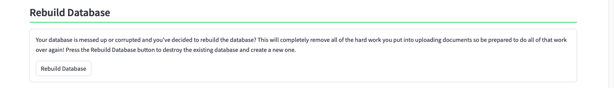

If your database is messed up, or corrupted, then you will need to rebuild the database. This will completely remove all the hard work you put into uploading documents so be prepared to do all of that work over again! Press the ++"Rebuild Database"++ button to destroy the existing database and create a new one.

The rebuild process will go through several steps to reset the database. The entire process usually takes less than a minute to complete.

## Add Library

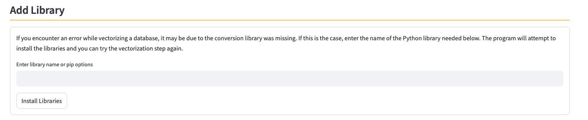

This program contains most (not all!) of the conversion libraries required for importing documents into the system. If you encounter an error while importing a document, it may be due to one the conversion library was missing. The first step is to check the Log file and determine what library the system is complaining about. 

In this example, we tried to vectorize a Microsoft Word file with an extension of `.DOCX`. 

Switching to the Log viewer, scrolling to the end we see that the library `docx2txt` is required for the document to be vectorized.

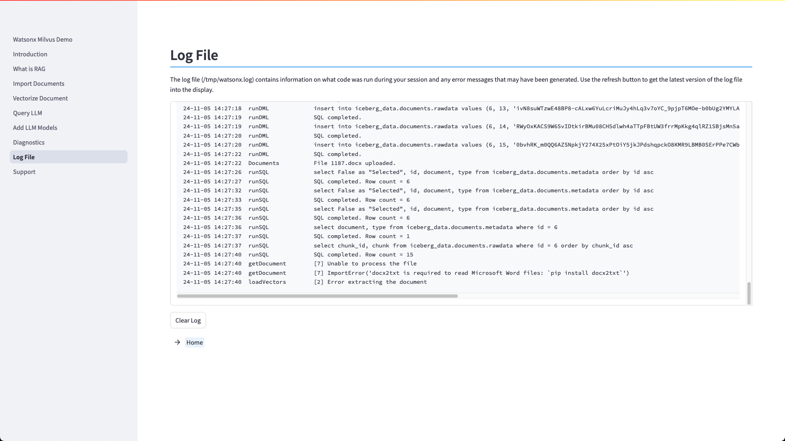

Enter the name of the required library into the library name field and press ++"install Libraries"++.

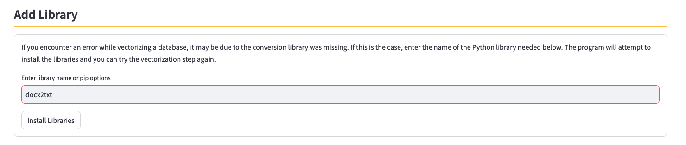

The system will display a success message when the command completes.

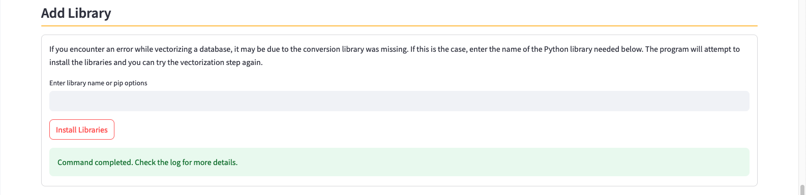

You should review the log file to make sure that the installation was successful. Some libraries have multiple requirements and there may be more than one file that gets installed. Always best to check to see the messages in the log file.

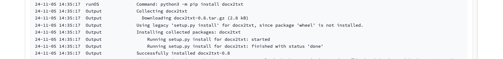

Now that the library has been loaded, we can attempt to vectorize the document again.

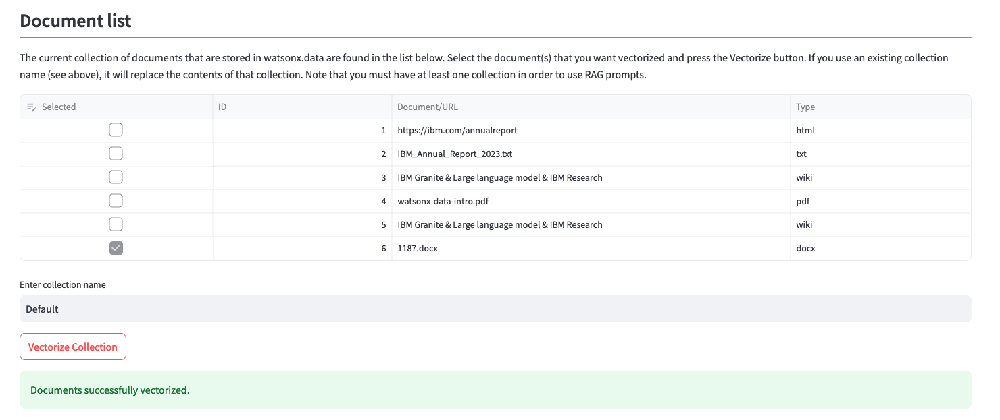

## Update Software

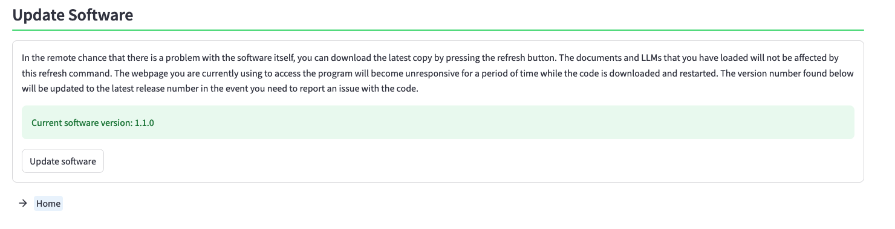

When you deploy an image from TechZone, the latest software for this demonstration program is loaded into the system. If there has been an update (or a fix released for an issue you came across), you can update the software by clicking the ++"Update software"++ button. The current release of the software is shown in the panel.

The update process will take several minutes. The first step will download the software and then switch to the Main screen. Once the update is complete, the main menu will be displayed. You can check the software level by viewing the Update Software section of the Diagnostic panel.

## Restart Application

Normally, you do not need to restart the application after a software update. However, if you find that you are unable to upload documents (403 code), you may need to restart the application. This will stop the program and restart it. The application will stop responding for a few minutes while the service restarts. When you log back into the application, it will return to the diagnostics screen.

If you receive an error code on the screen, continue to refresh the browser until the log in window displays.

