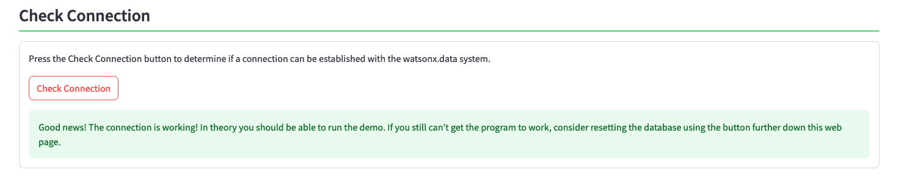

# Diagnostics

You usually end up in the Diagnostics section because something went wrong with your server. Hopefully one of the sections below will help solve the problem that you are having.

There are 8 sections in the diagnostics screen. These sections cover the following topics:

* Check Presto Connection
* Check watsonx.data System
* Restart Presto
* Restart watsonx.data
* Restart LLM Service
* Rebuild Database
* Add Library
* Update Software

### Check Presto Connection

Press the ++"Check Connection"++ button to determine if a connection can be established with the watsonx.data system. The system will either tell you that the connection is okay, or that the connection timed out.

If the connection timed out, you will need to move on to the next step and check if the watsonx.data system is running.

### Check watsonx.data System

If your connection failed (hint, see button above) then something may be wrong with the Presto engine or watsonx.data. You can check to see what services are up and running in our server by pressing the ++"Check Services"++ button.

 If you find that the Presto instance is missing, restart Presto. If more than one service is missing you will need to restart the watsonx.data services.

### Restart Presto

### Restart watsonx.data

### Restart LLM Service

### Rebuild Database

### Add Library

### Update Software
