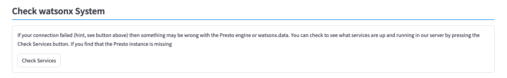
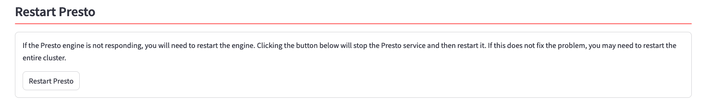
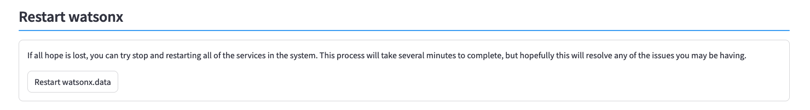
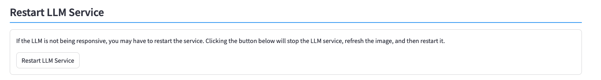
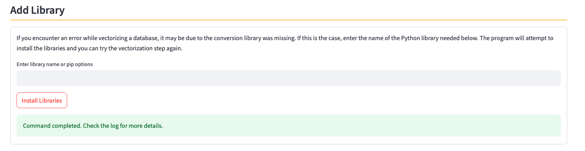
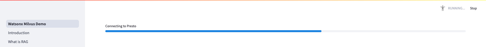
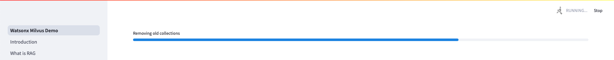

# Diagnostics

You usually end up in the Diagnostics section because something went wrong with your server. Hopefully one of the sections below will help solve the problem that you are having.

There are 8 sections in the diagnostics screen. These sections cover the following topics:

* Check Presto Connection
* Check watsonx.data System
* Restart Presto
* Restart watsonx.data
* Restart LLM Service
* Rebuild Database
* Add Library
* Update Software

### Check Presto Connection

Press the ++"Check Connection"++ button to determine if a connection can be established with the watsonx.data system. The system will either tell you that the connection is okay, or that the connection timed out.

If the connection timed out, you will need to move on to the next step and check if the watsonx.data system is running.

### Check watsonx.data System

If your connection failed (hint, see button above) then something may be wrong with the Presto engine or watsonx.data. You can check to see what services are up and running in our server by pressing the ++"Check Services"++ button.

 If you find that the Presto instance is missing, restart Presto. If more than one service is missing you will need to restart the watsonx.data services.

### Restart Presto

If you've determined that the Presto service is down, you can use this section to shut down and restart Presto. Press the ++"Restart Presto"++ button to begin the process.

The display will show a progress indicator that tracks the Presto startup process. Note that this can take a few minutes to complete. The system will display a success message when the startup has completed.

### Restart watsonx.data

If nothing seems to work (or mote than one service is stopped), you can try stop and restarting all services in the system. This process will take several minutes to complete, but hopefully this will resolve any of the issues you may be having.

Start the process by clicking the ++"Restart watsonx.data"++ button. This process will display multiple messages as it stops and starts services.

Restarting the watsonx.data services will take several minutes, as will the startup for Presto. Once the process is complete, you should see a successful completion message.

### Restart LLM Service

If the LLM is not being responsive, you may have to restart the service. Clicking the ++"Restart LLM Service"++ button will stop the LLM service, refresh the image, and then restart it.

You may want to restart the service if you come across an error loading an LLM which indicates that the LLM manager is out of date. The can occur when an LLM has features which are not currently supported in the LLM manager. Restarting the LLM manager will automatically refresh the image to the latest version available.

### Rebuild Database

If your database is messed up, or corrupted, then you will need to rebuild the database. This will completely remove all the hard work you put into uploading documents so be prepared to do all of that work over again! Press the ++"Rebuild Database"++ button to destroy the existing database and create a new one.

The rebuild process will go through several steps to reset the database. The entire process usually takes less than a minute to complete.

### Add Library

This program contains most (not all!) of the conversion libraries required for importing documents into the system. If you encounter an error while importing a document, it may be due to one the conversion library was missing. The first step is to check the Log file and determine what library the system is complaining about. 

In this example, we tried to vectorize a Microsoft Word file with an extension of `.DOCX`. 

Switching to the Log viewer, scrolling to the end we see that the library `docx2txt` is required for the document to be vectorized.

Enter the name of the required library into the library name field and press ++"install Libraries"++.

The system will display a success message when the command completes.

You should review the log file to make sure that the installation was successful. Some libraries have multiple requirements and there may be more than one file that gets installed. Always best to check to see the messages in the log file.

Now that the library has been loaded, we can attempt to vectorize the document again.

### Update Software

When you deploy an image from TechZone, the latest software for this demonstration program is loaded into the system. If there has been an update (or a fix released for an issue you came across), you can update the software by clicking the ++"Update software"++ button. The current release of the software is shown in the panel.

The update process will take several minutes. The first step will download the software and then switch to the Main screen. The system will then update several services in the system and provide a progress indicator:

* Checking Milvus

* Checking Presto

* Removing old collections

* Insert default documents

* Updating LLM Engine (not shown)

Once the update is complete, the main menu will be displayed. You can check the software level again by checking the Diagnostic panel again.

