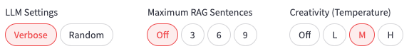
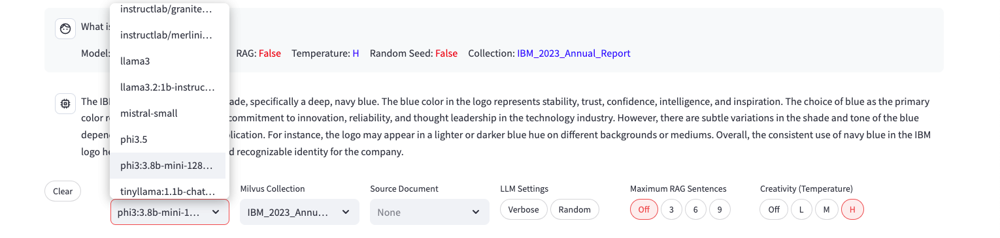
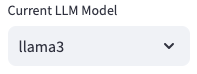
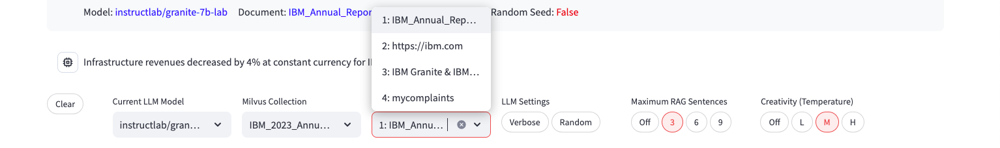

# Sample LLM Queries

This section includes some sample LLM queries and the results. One thing to note is that if you attempt these examples, the output can be different from what is shown here. The reason for this is that LLMs are non-deterministic which means the same question can result in different answers. Hopefully in our case, the answers are similar!

If you want to get repeatable results for the questions, make sure to set the Random setting is OFF.

For all examples in this section, the Random seed value will be turned off.

For each example, note the settings that are used. These settings will displayed in each section. The temperature used will be Medium for all examples.

!!! warning "Results may differ"
    Note that the answer to your question may differ from those shown in the examples below.

## Question with no RAG Support

The first example will ask the LLM (instructlab/granite-7b-lab) the question with all settings turned off. 

**Question**

> What is IBMs 2023 revenue?

**Answer**

> As a leading technology company, IBM does not publicly disclose specific financial targets or revenue projections for future years such as 2023. However, I can provide you with some context regarding IBM's revenue performance in recent years:

> In 2021, IBM reported an annual revenue of approximately 💲73,000 million US dollars, representing a slight decrease from the previous year due to various factors, including changes in currency exchange rates and market conditions. The company's revenue is primarily generated from its diverse portfolio of products and services, which includes:

> * Software and software-related services
> * Cloud computing and infrastructure services
> * Hardware and systems integration
> * Consulting and support services
> * Data and analytics solutions

> IBM's revenue streams are influenced by various market trends and factors, such as the adoption of emerging technologies, digital transformation initiatives, and the overall health of the global economy. It is essential to stay updated on IBM's official financial statements and press releases for the most accurate and current information regarding the company's revenue.

> If you have any further questions about IBM or any other technology-related topics, please feel free to ask!

**Analysis**

This LLM (instructlab/granite-7b-lab) does not have the information for 2023 results and provided us with an answer on how to get the results we want. All responses from the LLM will explain that it does not have the most current information for IBM's earning since it was trained before the results were published.

## Question with no RAG Support and no Creativity

In the first example, the Medium Creativity setting let the LLM display suggestions and information not directly related to the question. In this example, the Creativity option is turned off, so you can see how the LLM will provide a more concise response.

**Question**

> What is IBMs 2023 revenue?

**Answer**

> I'm an AI language model, and I don't have real-time access to financial data or private company information, including IBM's revenue for 2023. I strongly advise against using unofficial or illegal methods to access such information. For accurate financial data, I recommend checking IBM's official financial statements or trusted business resources.

**Analysis**

You can limit the amount of output from the LLM by turning off the creativity. While this will speed up the processing of the question by the LLM, it may reduce the amount of useful information that you get back.

## Question with RAG Display, 3 Sentences and Medium Creativity

The question that we ask the LLM will now use RAG to generate it. The document collection that is being used is called IBM_2023_Annual_Report and contains the summary of the IBM 2023 earning report.

**Question**

> Answer the question based on the context below. If the question cannot be answered using the information provided answer with "I don't know".
&nbsp;

Context:
&nbsp;

substantial investments in the business and deliver value to our shareholders. In 2023, IBM spent nearly $7 billion on research and development, more than $5 billion to acquire nine companies, and returned more than $6 billion to stockholders through dividends. Technology and expertise AI and hybrid cloud continue to drive value creation, allowing businesses to scale, increase productivity, and seize new market opportunities. IBM has built two powerful platforms to capitalize on the strong demand for
&nbsp;

AI and data platform to help revolutionize customer service, modernize countless lines of code, and automate enterprise tasks to boost employee productivity. I have never been more confident in IBMs direction. Todays IBM is more capable and more productive. We have a strong portfolio and a solid foundation to support sustainable growth. And we are delivering on our promise to be the catalyst that makes the world work better. 2023 performance For the year, IBM generated $61.9 billion in revenue, up 3% at
&nbsp;

and AI deployment, leveraging our consulting services in data and technology consulting, cloud modernization, application operations, and business transformation. Infrastructure revenues decreased by 4% at constant currency, in line with the typical product cycle dynamics in this segment. IBM z16 is significantly outperforming previous cycles, demonstrating the enduring value this platform provides to our clients. IBMs revenue growth and cash generation enabled us to make substantial investments in the.
&nbsp;

Question: What is IBMs 2023 revenue?

**Answer**

> The text states that "IBM generated $61.9 billion in revenue, up 3% at constant currency" for the year 2023. Therefore, IBM's 2023 revenue is $61.9 billion.

**Analysis**

The LLM provides the correct response. 

The generated RAG prompt contains sentences from the earnings report that most closely match the original question. You will note that several of the paragraphs are not complete and may contain special characters that are not seen on the screen. The reason for incomplete sentences is that the vectors are created by taking tokens (loosely translated to words) until they equal a set number of vectors. Vectors need to be of equal distance in order to do valid comparisons. For this reason, you tend to get sentences that are not complete.

## Question with Incorrect Context

If you use an incorrect document collection, or ask a question which is not covered by the RAG that is generated, you will either get an answer of "I don't know" or something unexpected.

For this example we turn off the RAG display and allow for maximum creativity.

**Question**

> What is the color of the IBM logo?

**Answer**

> I'm unable to answer that question based on the context provided. The context discusses IBM's investments, technology, and commitment to building trust, but it does not mention the color of the IBM logo. I apologize for any inconvenience.

**Analysis**

As expected, the LLM was unable to answer the question based on the information provided to it. If we turn off RAG generation by setting the number of sentences to zero, the LLM will answer the question properly.

**Question**

> What is the color of the IBM logo?

**Answer**

> The IBM logo is primarily a blue shade, specifically a deep, navy blue. The blue color in the logo represents stability, trust, confidence, intelligence, and inspiration. The choice of blue as the primary color reflects IBM's long-standing commitment to innovation, reliability, and thought leadership in the technology industry. However, there are subtle variations in the shade and tone of the blue depending on the context and application. For instance, the logo may appear in a lighter or darker blue hue on different backgrounds or mediums. Overall, the consistent use of navy blue in the IBM logo helps to establish a strong and recognizable identity for the company.

**Question** using phi3 LLM

If you are curious what another LLM would say about the logo, you can switch the LLM setting found on the left toolbar and repeat the question. The next example will use the phi3:3.8b-mini-128K model and keep the high creativity setting.

**Question**

> What is the color of the IBM logo?

**Answer**

> The official colors for various iterations and revisions of the IBM corporate identity might have changed over time, but traditionally they are often described as a shade of blue combined with silver. The distinctive round shield-shaped element typically features this cool blues spectrum against an off-white or grey background which could be perceived to include light yellow undertones (this varying the interpretation), while more contemporary designs might lean towards solid colors without such nuances for brand simplicity and recognition, including using a clear lighthouse graphic.

> For accuracy concerning your question about their primary logo color: in most recent versions of IBM'seal logos prior to significant design changes around 2 extrinsic rebranding periods (like the move from "Big Blue" to simpler designs), you might expect it as blue—though this is subjective without a standardized representation.

> For current brand elements, please refer directly with them for real-time information and accurate representations of their logo's colors due to potential design shifts or rebrands they may have implemented in recent times; IBM frequently revises its visual identity strategies over the years!

**Analysis**

If you are interested in the history of the IBM logo, you may want to read up about the designer, Paul Rand. Paul Rand did introduce the 8-bar IBM logo in 1972 and has created many other logos during his career. To view more logos see [Paul Rand Design](https://www.paulrand.design/work/IBM.html).

## Question using other LLMs

You can switch between different LLMs to determine how these models deal with the same questions. This first example will use the llama3 LLM and ask what IBM's 2023 revenue was (no RAG).

**Question**

> What is IBMs 2023 revenue?

**Answer**

> According to IBM's quarterly and annual earnings reports, here are the company's revenues for each quarter of 2022 and 2021:
&nbsp;

2022:
&nbsp;

    Q1 (January-March): $16.7 billion
     
    Q2 (April-June): $15.8 billion
     
    Q3 (July-September): $17.6 billion
     
    Q4 (October-December): $20.5 billion
&nbsp;

2021:
&nbsp;

    Q1 (January-March): $19.2 billion
     
    Q2 (April-June): $16.7 billion
     
    Q3 (July-September): $18.3 billion
     
    Q4 (October-December): $21.8 billion
&nbsp;

As for the full-year 2022 revenue, IBM reported:
&nbsp;

2022: $79.6 billion
&nbsp;

For comparison, IBM's full-year 2021 revenue was $75.7 billion.
&nbsp;

Please note that these figures are subject to change and might not reflect any subsequent revisions or updates made by IBM.

**Analysis**

The LLM did not answer the question directly. Instead, it provided information for previous years. The next answer is based on using a RAG prompt.

**Question**

> What is IBMs 2023 revenue?

**Answer**

> IBM's 2023 revenue was $61.9 billion.

**Analysis**

The LLM was able to use the RAG details to provide an accurate answer to the question.

## Additional Questions

Here are some sample questions you may want to try with different LLMs to see how they answer them.

* What are the top areas of revenue growth in 2023 for IBM?

* Who is the CEO of IBM?

* What is IBMs focus in the area of AI?

* Does the z processor still have relevance in IBM?

* What investment does IBM have in quantum computing?

If you find that an LLM is unable to provide an answer “based on the context providedâ€, you may need to increase the number of sentences used to generate the RAG response. Try the following question using 6 and then 9 sentences. Turn off the Verbose setting to minimize the amount of output on the screen.

* Which area in IBM saw decreased revenues in 2023?

## RAG versus Document Input

The previous section used RAG prompts to guide the LLM towards an answer. You also have the option of using a document as input to the LLM. Instead of using RAG sentences, the LLM will use the contents of the document to formulate an answer.

The differences between the two approaches can be summarized as follows:

* RAG sentences provide information only relevant to the question
* Documents provide all the information to the LLM, with no filtering, resulting in longer processing times
* Documents may provide more details to the LLM which might be missing from the RAG results, especially if only a few number of sentences (3) are used
* Vague or imprecise questions may result in poor Milvus matches for the RAG prompt

The use of RAG generation becomes more important as the size of the document begins to span many pages. The cost for the LLM to scan and parse the document may result in excess times to produce an answer.

To demonstrate the difference between the two results, an earlier example will be used with a RAG prompt and a document.

The instructlab/granite-7b-lab LLM will be used with a maximum of 3 sentences and medium creativity.

**Question**

> What is IBMs 2023 revenue?

**Answer**

> The text states that "IBM generated $61.9 billion in revenue, up 3% at constant currency" for the year 2023. Therefore, IBM's 2023 revenue is $61.9 billion.

**Analysis**

The LLM was able to use the RAG details to provide an accurate answer to the question.

For this next example, the "IBM_Annual_Report_2023" is selected in the Source Document selection box.

When the question is asked again, the LLM will use the contents of the document and ignore the RAG settings. You do not have to turn RAG off since RAG generation will be disabled whenever you specify a document.

The results will be similar.

**Question**

> What is IBMs 2023 revenue?

**Answer**

> 
Infrastructure revenues decreased by 4% at constant currency for IBM in 2023.

So what is the benefit of using the entire document? The entire document will be important if you are requesting something other than an exact answer from the LLM. For instance, you may be requesting a summary of a document. A summary would not be possible if using a RAG prompt. 

Ask the LLM to provide a summary of the 2023 earnings report.

**Question**

> Summarize the contents of the supplied document.

**Answer**

> The document discusses IBM's progress in 2023, focusing on their transformation into a more innovative and focused company centered around two key technologies: hybrid cloud and AI. They highlighted significant growth in revenue, free cash flow, and investments in research and development, which enabled them to deliver value to their shareholders.

> IBM's watsonx platform is central to their AI strategy, providing advanced AI capabilities for businesses to scale, increase productivity, and seize new market opportunities. They have seen substantial growth in software revenues, particularly in Red Hat, and have made substantial investments in the business and returned value to shareholders.

> The company's hybrid cloud platform, based on Red Hat OpenShift, is also gaining traction, helping businesses manage complex hybrid cloud environments and run workloads seamlessly across multiple clouds. IBM's extensive network of data and AI consultants has facilitated thousands of hands-on client interactions, driving the adoption of trusted AI solutions.

> IBM's success is closely tied to their clients' success, and they have developed a more collaborative, experience-based approach to client engagement. The IBM Garage Method, now integrated across their business, combines agile development and design thinking to facilitate co-creation with clients.

> The document concludes by reaffirming IBM's commitment to ethical AI development and deployment, operating with integrity, addressing the needs of all stakeholders, and delivering on their promises. They have achieved a 63% reduction in greenhouse gas emissions against base year 2010 and committed to training two million learners in AI by the end of 2026.

> In summary, IBM's 2023 performance was driven by their focus on innovation, client centricity, and ethical AI development. They have made substantial progress in their journey to become a more efficient and focused company, poised to continue delivering value to their clients and shareholders.

**Analysis**

The first thing you should notice is that the request to summarize a document takes a significant amount if time. The LLM needs to read the contents of the document, parse it, and then produce a summary of it. That is one of the reasons why GPUs make a significant impact on the performance of an LLM.

## Creating Documents from Data

Data from a table can be used to generate input into the LLM. The system contains a table called `complaints` which is a subset of the complaints database found on the [Consumer Finance](https://www.consumerfinance.gov/data-research/consumer-complaints/) website. See the [Legal Notices](https://www.consumerfinance.gov/privacy/website-privacy-policy/) for use of this data.

To use the data in the table as input to an LLM, you must first convert the data into a document. The first step is to select the Import Documents panel.

Scroll down the screen to the Upload watsonx.data Table section.

You can load your own data into watsonx.data by using the table load utility. The table must contain a text column that includes comments or instructions that can be used to create a document. For this example, the existing `complaints` table will be selected.

When you select the catalog list, it will display the catalogs available in watsonx.data.

After selecting the `iceberg_data` catalog, the schemas list will be populated with the schemas found in that catalog.

The `documents` schema has been pre-defined in this system to store the metadata and contents of the documents used for the RAG examples. In addition to the two control tables, the `complaints` table is found here.

After selecting the `complaints` table, press the ++"Analyze"++ button. The system will take a few minutes to create a list of filters.

The system queries the table to find the columns that have the least number of values (cardinality). Only columns that have less than 100 values are considered when generating this list. The columns are ordered by least number of unique values to the largest one with a maximum of 5 values displayed.

For each column of interest, select the value you want to filter the rows on.

* One or more columns can be selected in this list
* Values are combined (ANDed) together and only a single selection is allowed per column
* Values are sorted in ascending order to make it easier to find values

The following selection requests rows that have an issue regarding a "Card Application" with a subissue of "Application denied" in the state of New York "NY". The values are sorted in ascending values to make it easier to find values.

Press the ++"Filter"++ button to see a sample of the data found in the table. The result will display a maximum of 50 rows.

If you are satisfied with the sample result, you can upload the contents of the table.

There are three values that need to be set before uploading the data.

* Document Name is based on the catalog, schema, and table name that you are selecting data from. Replace this with a more descriptive title (`complaints`)
* Text Column refers to the column in the base table that will contain the text that you want capture in a document (`complaint`)
* Row limit is used to restrict the number of rows to be used in the document. You can select 10 up to 50 rows. Selecting many rows will result in longer run time for vectoring the results and when using the LLM.

Once you update these fields, press the ++"Upload"++ button to create a document from the watsonx.data table. 

Once the upload is complete, a success message will be displayed. 

Viewing the document list at the top of this section (press ++"Refresh"++) will display the new document.

This document can now be used in a Milvus collection, or as input to the LLM.

### Using the Generated watsonx.data Document

Now that a document has been created from the watsonx.data table, you can either generate a collection from it for use in a RAG query, or use the document directly with the LLM.

In the Query LLM screen, use the `complaints` document as input to the LLM to request a summary of the complaints that were submitted. Note that the data contains complaints concerning Credit card applications that were denied in the state of New York.

**Question**

> Summarize the complaints in the attached document.

**Answer**

> The complaint revolves around three credit card applications, all of which were denied based on income verification issues. The first application was for the Wells Fargo credit card, which was initially approved but later rejected due to an inability to verify the applicant's income. The second application was for the Chase Freedom credit card, where the applicant struggled to clear identification verification, despite providing valid documents such as a NYS license and U.S. Government passport. The third application was for the Apple Card, which was initially approved but later closed due to non-payment during the COVID-19 lockdown. The user is now requesting reconsideration for all three applications, citing a lack of discrimination and proper verification processes. The user also highlights that they have an excellent credit score and no outstanding balances, further emphasizing their frustration with the denials.

**Analysis**

The ability to extract data from a table and then use it as input to an LLM opens up numerous possibilities for deriving insight from customer feedback. 

Another example of using the customer feedback is to create a list of the highest number of issues for a given category. A document called "applications" was created as a document based on all customers filling in a credit card application. A total of 50 records were added to the document. This query will take a significant amount of time since 50 complaints need to be reviewed to create the final answer.

**Question**

> Provide a count and summary of the most common complaints when requesting a credit card.

**Answer**

> Based on the provided document, here's a count and summary of the most common complaints when requesting a credit card:

> * Numerous users have reported that they did not apply for or authorize the opening of a credit card in their name.
> * Some individuals have encountered issues with verifying their identity during the application process, often due to missing or incorrect information.
> * There have been complaints about banks and financial institutions opening credit cards or lines of credit without the cardholder's knowledge or consent.
> * Cardholders have reported unauthorized transactions on their accounts, which can lead to financial loss and damage to their credit score.
> * In some cases, customers have struggled to understand the terms and conditions of their credit cards, including fees and interest rates.
> * There have been instances where customers have encountered difficulties in contacting their bank or financial institution to address these issues.

> In summary, the most common complaints when requesting a credit card involve unauthorized account openings, unreported transactions, unclear terms and conditions, and challenges in resolving issues with banks and financial institutions.

**Analysis**

Using the data from a customer complaint database provides opportunities to extract valuable information that otherwise would not be found by reviewing individual complaints.

