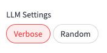

# Sample LLM Queries

This section includes some sample LLM queries and the results. One thing to note is that if you attempt these examples, the output can be different than what is shown here. The reason for this is that LLMs are not deterministic which means the same question can result in different answers. Hopefully in our case, the answers are similar!

If you want to get repeatable results for the questions, make sure to set the Random Seed setting to OFF:

To display the settings used for each query, turn the Display Settings on.

This will place a line below each question with the settings used to generate the prompt to the LLM.

For each example, note the settings that are used. These settings will displayed in each section. 

|LLM|Use RAG Prompt|Display RAG Prompt|Concise Response|Sentences
|-----|:------------:|:----------------:|:--------------:|:-------:
|granite-7b-lab |&#9989;|&#9989;|&#10060;|3
   
## Question with no RAG Support

The first example will ask the LLM the question with all settings turned off. 

|LLM|Use RAG Prompt|Display RAG Prompt|Concise Response|Sentences
|-----|:------------:|:----------------:|:--------------:|:-------:
|granite-7b-lab |&#10060;|&#10060;|&#10060;|-

#### Question

> What is IBMs 2023 revenue.

#### Answer

> As a helpful AI assistant, I don't have real-time access to the internet or proprietary company information, so I can't provide you with the exact 2023 revenue of IBM. However, I can give you some context about IBM's financial performance and how to find this information officially.
&nbsp;

IBM is a multinational technology corporation that provides various products and services, including hardware, software, cloud, consulting, and support. The company releases its annual reports and financial statements, which contain detailed revenue information for different segments and geographical regions. To access IBM's 2023 revenue, I recommend visiting the official IBM investor relations website (https://www.ibm.com/investor/reports-and-presentations) or the Securities and Exchange Commission (SEC) filings database (https://www.sec.gov/).
&nbsp;

These resources will provide you with the most accurate and up-to-date financial information about IBM, including its revenue for the year 2023, once it is officially released.

#### Analysis

The LLM does not have the information for 2023 results and provided us with an answer on how to get the results we want.

## Question with no RAG Support but Concise Response

The first example let the LLM display as much output as it wanted. In this example, the Concise Response is turned on, as well as the Display RAG prompt,so you can see how the program modified the question.

|LLM|Use RAG Prompt|Display RAG Prompt|Concise Response|Sentences
|-----|:------------:|:----------------:|:--------------:|:-------:
|granite-7b-lab |&#9989;|&#10060;|&#9989;|-

#### Question

> Provide a concise response to this prompt: What is IBMs 2023 revenue?

#### Answer

> As an AI language model, I don't have real-time capabilities or access to current, confidential, or proprietary information from IBM or any other organizations. I cannot provide the exact 2023 revenue for IBM. For accurate financial data, I encourage you to consult IBM's official financial statements or trusted business resources.

### Analysis

You can limit the amount of output from the LLM by turning on the concise flag. While this will speed up the processing of the question by the LLM, it may reduce the amount of useful information that you get back.

## Question with RAG On, Concise On, RAG Display, and 3 Sentences

The question that we ask the LLM will now use RAG to generate it. The document collection that is being used is called IBM_2023_Annual_Report and contains the summary of the IBM 2023 earning report.

|LLM|Use RAG Prompt|Display RAG Prompt|Concise Response|Sentences
|-----|:------------:|:----------------:|:--------------:|:-------:
|granite-7b-lab |&#9989;|&#9989;|&#9989;|3

#### Question

> Answer the question based on the context below. If the question cannot be answered using the information provided answer with "I don't know".
&nbsp;

Context:
&nbsp;

Todays IBM is more capable and more productive. We have a strong portfolio and a solid foundation to support sustainable growth. And we are delivering on our promise to be the catalyst that makes the world work better. 2023 performance For the year, IBM generated $61.9 billion in revenue, up 3% at constant currency, and $11.2 billion of free cash flow, up $1.9 billion year-over-year. We experienced growing demand for our new watsonx platform, marked by thousands of client
&nbsp;

Infrastructure revenues decreased by 4% at constant currency, in line with the typical product cycle dynamics in this segment. IBM z16 is significantly outperforming previous cycles, demonstrating the enduring value this platform provides to our clients. IBMs revenue growth and cash generation enabled us to make substantial investments in the business and deliver value to our shareholders. In 2023, IBM spent nearly $7 billion on research and
&nbsp;

IBM spent nearly $7 billion on research and development, more than $5 billion to acquire nine companies, and returned more than $6 billion to stockholders through dividends. small arrow software Software consulting Consulting infrastructure Infrastructure Technology and expertise AI and hybrid cloud continue to drive value creation, allowing businesses to scale,.
&nbsp;

Question: Provide a concise response to What is IBMs 2023 revenue?

#### Answer

> IBM's 2023 revenue was $61.9 billion, as stated in the context.

#### Analysis

The LLM provides the correct response. 

The generated RAG prompt contains sentences from the earnings report that most closely match the original question. You will note that several of the paragraphs are not complete and may contain special characters that are not seen on the screen. The reason for incomplete sentences is that the vectors are created by taking tokens (loosely translated to words) until they equal a set number of vectors. Vectors need to be of equal distance in order to do valid comparisons. For this reason, you tend to get sentences that are not complete.

## Question with Incorrect Context

If you use an incorrect document collection, or ask a question which is not covered by the RAG that is generated, you will either get an answer of "I don't know" or something unexpected.

For this example we turn off the RAG display and allow for unrestricted output.

|LLM|Use RAG Prompt|Display RAG Prompt|Concise Response|Sentences
|-----|:------------:|:----------------:|:--------------:|:-------:
|granite-7b-lab |&#9989;|&#10060;|&#10060;|3

#### Question

> What is the color of the IBM logo?

#### Answer

> I'm sorry for any confusion, but the information provided in the context does not include details about the color of the IBM logo. I cannot accurately answer this question with the given context.

#### Analysis

As expected, the LLM was unable to answer the question based on the information provided to it. If we turn off RAG generation, the LLM will answer the question properly.

|LLM|Use RAG Prompt|Display RAG Prompt|Concise Response|Sentences
|-----|:------------:|:----------------:|:--------------:|:-------:
|granite-7b-lab |&#10060|&#10060;|&#10060;|-

#### Question

> What is the color of the IBM logo?

#### Answer

> The IBM logo is primarily a blue color, specifically a shade of Navy Blue (Pantone 285C). This blue hue is often associated with trust, stability, and confidence. However, it's important to note that the IBM logo also incorporates white and black elements, which contribute to its overall simplicity and clarity. The white space in the logo helps to balance the blue and black, making it easily recognizable and distinguishable on various backgrounds. Overall, the IBM logo is a well-designed and versatile emblem that effectively represents the company's identity and values.

#### Question using phi3 LLM

If you are curious what another LLM would say about the logo, you can switch the LLM setting found on the left toolbar and repeat the question.

|LLM|Use RAG Prompt|Display RAG Prompt|Concise Response|Sentences
|-----|:------------:|:----------------:|:--------------:|:-------:
|phi3:3.8b-mini-128k |&#10060|&#10060;|&#10060;|-

#### Question

> What is the color of the IBM logo?

#### Answer

> The color scheme for the IBM (International Business Machines Corporation) logo has undergone various changes since its inception. The most recognizable version today, first introduced in 1972 by graphic designer Paul Rand and known as "Blue Intrigue," features a blue oval with rounded corners. Within this blue space is the corporate name: International Business Machines Corporation (IBM). There are no specific colors associated that aren't part of the overall color scheme, which remains primarily in shades of dark blues complemented by white text and accents against other company branding materials for consistency with their global market presence.

#### Analysis

Paul Rand did introduce the 8-bar IBM logo in 1972 and has created many other logos during his career. To view more logos see [Paul Rand Design](https://www.paulrand.design/work/IBM.html).

## Question using other LLMs

You can switch between different LLMs to determine how these models deal with the same questions. This first example will use the llama3 LLM and ask what IBM's 2023 revenue was (no RAG).

|LLM|Use RAG Prompt|Display RAG Prompt|Concise Response|Sentences
|-----|:------------:|:----------------:|:--------------:|:-------:
|llama3  |&#10060;|&#10060;|&#10060;|-

#### Question

> What is IBMs 2023 revenue?

#### Answer

> According to IBM's quarterly and annual earnings reports, here are the company's revenues for each quarter of 2022 and 2021:
&nbsp;

2022:
&nbsp;

    Q1 (January-March): $16.7 billion
     
    Q2 (April-June): $15.8 billion
     
    Q3 (July-September): $17.6 billion
     
    Q4 (October-December): $20.5 billion
&nbsp;

2021:
&nbsp;

    Q1 (January-March): $19.2 billion
     
    Q2 (April-June): $16.7 billion
     
    Q3 (July-September): $18.3 billion
     
    Q4 (October-December): $21.8 billion
&nbsp;

As for the full-year 2022 revenue, IBM reported:
&nbsp;

2022: $79.6 billion
&nbsp;

For comparison, IBM's full-year 2021 revenue was $75.7 billion.
&nbsp;

Please note that these figures are subject to change and might not reflect any subsequent revisions or updates made by IBM.

#### Analysis

The LLM did not answer the question directly. Instead, it provided information for previous years. The next answer is based on using a RAG prompt.

|LLM|Use RAG Prompt|Display RAG Prompt|Concise Response|Sentences
|-----|:------------:|:----------------:|:--------------:|:-------:
|llama3  |&#9989;|&#10060;|&#9989;|3

#### Question

> What is IBMs 2023 revenue?

#### Answer

> IBM's 2023 revenue was $61.9 billion, up 3% at constant currency.

#### Analysis

The LLM was able to use the RAG details to provide an accurate answer to the question.

## Additional Questions

Here are some sample questions you may want to try with different LLMs to see how they answer them.

* What are the top areas of revenue growth in 2023 for IBM?

* Who is the CEO of IBM?

* What is IBMs focus in the area of AI?

* Does the z processor still have relevance in IBM?

* What investment does IBM have in quantum computing?ß

If you find that an LLM is unable to provide an answer “based on the context provided”, you may need to increase the number of sentences used to generate the RAG response. Try the following question using 3 and then 9 sentences. Turn off Display RAG Prompt to minimize the amount of output on the screen.

* Which area in IBM saw decreased revenues in 2023?