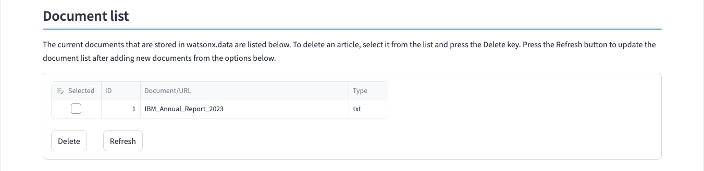
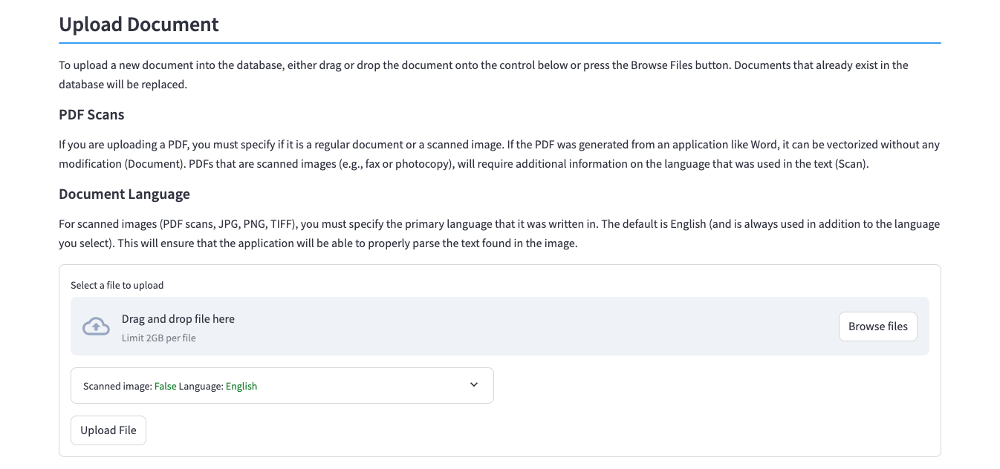
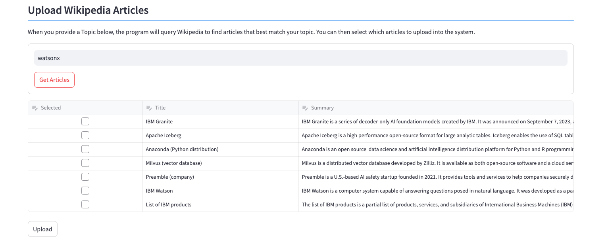
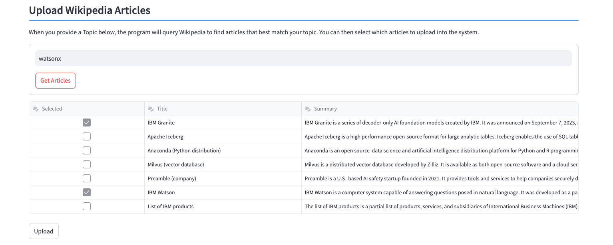
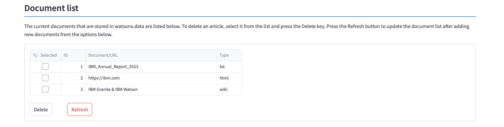

# Document Import and Storage

This system requires that you upload documents or URLs to be used for RAG generation. There is one document (IBM 2023 earnings report summary) provided in the system that you can use for your queries. You have the option of uploading documents from your workstation (PDF, PPT, TXT) and having it cataloged in watsonx.data. You can also point to a website (URL) which will be analyzed, and the contents extracted and stored in watsonx.data. Note that the system does not do a web crawl through all links in the web page, but only captures the text on the web page itself.

Finally, you can query Wikipedia and retrieve documents based on a topic.

## Document Storage

The Document storage panel contains three sections in it:

* Document list
* Upload Document or URL
* Upload Wikipedia Articles


### Document List
The document list provides the list of documents that are already stored in the system. The IBM 2023 earnings documents are pre-populated in the system for you to use in the LLM queries.



The document display provides the name of the document or URL, and the document type. The document type is determined by the original document file type.

### Upload Document or URL

The Upload dialog provides a way of uploading a document from your workstation or by uploading the contents of a URL.



For local files, you can either drag and drop a file from your workstation into the dialog, or press the ++"Browse Files"++ button to display your local file browser (Mac OSX shown).


Once the file has been selected, it will be display below the drag and drop line. You can only upload one document at a time.


If you have a URL that you want to input into the system, type or paste the URL into the dialog. Once you have selected the file or URL that you want to upload, press the ++"Upload Doc/URL"++ button to start the upload process. A progress indicator will appear while the document is being uploaded.


When the upload completes, a success (or failure!) message will be displayed.


The document list at the top of the screen will not be updated to reflect the new document until you press the ++"Refresh List"++ button.

!!! warning "URL Scraping"

    Make sure that if you decide to use a web page as a source for your RAG examples, that it does not violate any copuright or privacy policies associated with the web page.

### Upload Wikipedia Documents

The bottom of the Document import panel contains an option to search Wikipedia articles for possible documents to use in a RAG prompt.


Enter a phrase to search for (watsonx is shown here) and press the ++"Get Articles"++ button. You will see a maximum of 10 documents that were found. In this example, 7 documents related to "watsonx" were found in Wikipedia articles. 



Select which articles you want to load into the system. You can select as many as you want, and they will be combined into a single document in the system.



Once you are done selecting the documents, press the ++"Upload"++ button and a progress indicator will display the progress of retrieving the articles.


Once the files have been uploaded, a message will be displayed.


In the Document display, the wiki article names are concatenated together, and the file type is shown as "wiki".



## Technical Details

Documents and the contents of web pages are stored in watsonx.data. There are two Iceberg tables within watsonx.data that store details of the documents. The first table contains document metadata:
```sql
CREATE TABLE iceberg_data.documents.metadata
    (
    "id"          int,
    "document"    varchar,
    "type"        varchar
    )
```
This simple table tracks the document name (or URL) along with the type of document. The type of document will determine what routine will be used to extract the text from the contents.

The second table contains the data from the document.
```sql
CREATE TABLE iceberg_data.documents.rawdata
    (
    "id"          int,
    "chunk_id"    int,
    "chunk"       varchar
    )
```

The data is split into approximately 1M base64 chunks. The reason for the chunking of the data is due to a Presto client limit of 1M messages. Once the data is stored in watsonx.data, access to the underlying object can be controlled through user and group authentication. The data is read and converted to BASE64 format and stored into a VARCHAR field. Upon retrieval, the document is rebuilt back into its' native format. Wiki files that were loaded into the system are always extracted as text files.

An alternate strategy to storing documents would be to upload the document and store it in an S3-like bucket. The downside is that the document is exposed in the bucket rather than obfuscated in Iceberg table format.

### Web Pages
Regular documents are stored "as-is" in watsonx.data, but URLs are handled differently. A web scraping routine extracts the text from the website and stores it in watsonx.data as a text document. What this means is that the data watsonx.data is valid as of the time the URL was uploaded. If the web page changes, it will not be reflected in the stored document. 

The web scraping program only retrieves the contents of the URL that was provided and does not traverse down any other links that may be on the web page.

### Wiki Pages

The program uses a Wikipedia API to retrieve articles that match the supplied keywords. Once you select which documents you want included in the system, the program will request the full contents of the document(s) from Wikipedia. The documents are concatenated together to create one text document in the database.

## Pre-loaded Documents
There is one document that has been pre-loaded into the system for your use (2023 IBM Annual Report). You can choose to upload your own documents to use with the LLMs. Some observations regarding documents.

* PDFs, DOCs, and Text create good RAG prompts with a minimum of 3 sentences
* PPTs require much more time to extract text and require more sentences (>5) to generate useful RAG prompts
* URLs generate RAG prompts that may contain images or gifs that are ignored