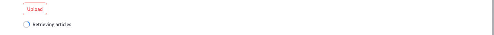
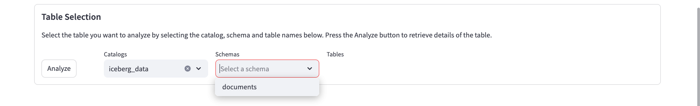
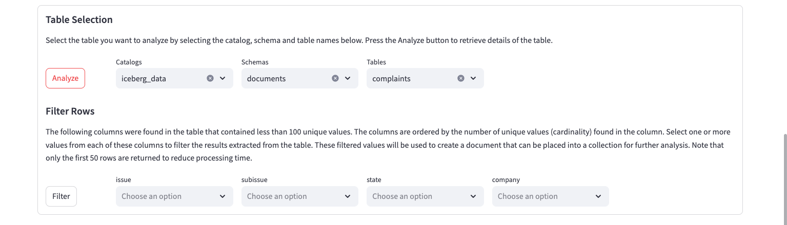
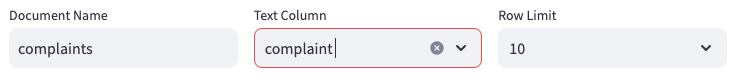
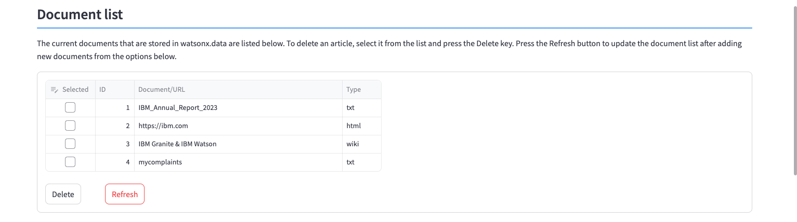

# Document Import and Storage

This system requires that you upload documents or URLs to be used for RAG generation. There is one document (IBM 2023 earnings report summary) provided in the system that you can use for your queries. 

You have the option of uploading documents from:

* A file found on your workstation (PDF, PPT, TXT, JPG, PNG, TIFF, DOC, XLS, TXT) 
* A website (URL). The contents will be analyzed, extracted and stored in watsonx.data. Note that the system does not do a web crawl through all links in the web page, but only captures the text on the web page itself.
* Wikipedia articles
* Data from a table that is cataloged in watsonx.data. A sample table (complaints) is cataloged in the system.

## Document Storage

The Document storage panel contains five sections in it:

* Document list and maintenance
* Upload Document
* Upload URL
* Upload Wikipedia Articles
* Upload watsonx.data Table


### Document List
The document list provides the list of documents that are already stored in the system. The IBM 2023 earnings documents are pre-populated in the system for you to use in the LLM queries.


The document display provides the name of the document or URL, and the document type. The document type is determined by the original document file type.

To delete a document, click on the box beside the document name and then press the ++"Delete"++ button. The list will be updated after the document has been deleted. Deleting a document does not remove any Milvus collections that include the document in the vectors. 

If you add a new document into the system, you will need to use the ++"Refresh"++ button to see the document list upated.

### Upload Document

The Upload dialog provides a way of uploading a document from your workstation.


For local files, you can either drag and drop a file from your workstation into the dialog, or press the ++"Browse Files"++ button to display your local file browser (Mac OSX shown).


Once the file has been selected, it will be displayed below the drag and drop line. You can only upload one document at a time.


Press the ++"Upload File"++ button to initiate the upload of the document. The system will display a success message when the file has been stored in watsonx.data.


If the document already exists in the watsonx.data system, it will be replaced with the new copy. If you don't want to overwrite an existing copy, make sure to use a different name for the file.

The document list at the top of the screen will not be updated to reflect the new document until you press the ++"Refresh"++ button.

#### Document Types

Below the file name is a dialog which summarizes the document type. These settings are automatically populated based on the document type. The default language is English and the Scanned Image setting is set to False for PDFs and text.


The system allows the following file types to be loaded into watsonx.data:

* PDF (generated)
* PDF (scanned)
* Image (TIFF, JPEG, PNG)
* XLS, PPT, DOC, TXT

For images and scanned PDFs, there is no information available to determine what language the document contains, nor if it was a scanned image.


A PDF that is generated by Microsoft Word or a similar product, will contain the written text and control characters. A PDF that was generated by scanning software will embed the scanned images into the PDF, so there will not be any written text. 

If your document is a scanned PDF, you must open the option window and select the scanned document box. If your document is a TIFF, JPEG, or PNG, these fields would have been automatically set for you. 

The default language is English (and it will be included as a language for all documents). If you know the language of your document, select it from the drop-down list. This will provide the text extraction routines some guidance on how to treat the text that is found in the image.

### Upload URL

If you have a URL that you want to input into the system, type or paste the URL into the dialog. Once you have selected the file or URL that you want to upload, press the ++"Upload URL"++ button to start the upload process. A progress indicator will appear while the URL is being uploaded.


When the upload completes, a success (or failure!) message will be displayed.


!!! warning "URL Scraping"

    Make sure that if you decide to use a web page as a source for your RAG examples, that it does not violate any copyright or privacy policies associated with the web page.

### Upload Wikipedia Documents

The bottom of the Document import panel contains an option to search Wikipedia articles for possible documents to use in a RAG prompt.


Enter a phrase to search for (watsonx is shown here) and press the ++"Get Articles"++ button. You will see a maximum of 10 documents that were found. In this example, 7 documents related to "watsonx" were found in Wikipedia articles. 


Select which articles you want to load into the system. You can select as many as you want, and they will be combined into a single document in the system.


Once you are done selecting the documents, press the ++"Upload"++ button and a progress indicator will display the progress of retrieving the articles.



Once the files have been uploaded, a completion message will be displayed.


In the Document display, the wiki article names are concatenated together, and the file type is shown as "wiki". Make sure to press the ++"Refresh"++ button to see the latest uploads.


### Upload watsonx.data Data

You can extract data from watsonx.data tables and use it as input for a RAG prompt or as a document for the LLM to use.


The table must contain a text column that includes comments or instructions that can be used to create a document. The system contains a table called `complaints` which is a subset of the complaints database found on the [Consumer Finance](https://www.consumerfinance.gov/data-research/consumer-complaints/) website. See the [Legal Notices](https://www.consumerfinance.gov/privacy/website-privacy-policy/) for use of this data.

You can load your own data into watsonx.data by using the table load utility. You can load a CSV table up to approximately 2M in size using this method. The `iceberg_data` catalog and `documents` schema should be used to load your table. You can use other catalogs or schemas, but this schema has been created for this demonstration system.


Once the data has been loaded or cataloged on watsonx.data, you can select the rows you want to load by using the table selection dialog.


When you select the catalog list, it will display the catalogs available in watsonx.data.


After selecting a catalog, the schemas list will be populated with the schemas found in that catalog.



One schema has been pre-defined in this system to store the metadata and contents of the documents used for the RAG examples. In addition to the two control tables, the `complaints` table is found here.


After selecting the table, press the ++"Analyze"++ button. The system will take a few minutes to create a list of filters.



The system queries the table to find the columns that have the least number of values (cardinality). Only columns that have less than 100 values are considered when generating this list. The columns are ordered by least number of unique values to the largest one with a maximum of 5 values displayed.

For each column of interest, select the value you want to filter the rows on.

* One or more columns can be selected in this list
* Values are combined (ANDed) together and only a single selection is allowed per column
* Values are sorted in ascending order to make it easier to find values

The following selection requests rows that have an issue regarding a "Card Application" with a subissue of "Application denied" in the state of New York "NY". The values are sorted in ascending values to make it easier to find values.


Press the ++"Filter"++ button to see a sample of the data found in the table. The result will display a maximum of 50 rows.


If you are satisfied with the sample result, you can upload the contents of the table.


There are three values that need to be set before uploading the data.

* Document Name is based on the catalog, schema, and table name that you are selecting data from. Replace this with a more descriptive title.
* Text Column refers to the column in the base table that will contain the text that you want capture in a document.
* Row limit is used to restrict the number of rows to be used in the document. You can select 10 up to 50 rows. Selecting a large number of rows will result in longer run time for vectoring the results and when using the LLM.

Once you update these fields, press the ++"Upload"++ button to create a document from the watsonx.data table.



Once the upload is complete, a success message will be created. 


Viewing the document list at the top of this section (press ++"Refresh"++) will display the new document.



This document can now be used in a Milvus collection, or as input to the LLM.

## Technical Details

Documents and the contents of web pages are stored in watsonx.data. There are two Iceberg tables within watsonx.data that store details of the documents. The first table contains document metadata:
```sql
CREATE TABLE iceberg_data.documents.metadata
   (
   "id"       integer,
   "document" varchar,
   "type"     varchar,
   "scan"     boolean,
   "language" varchar
   )    
```
This simple table tracks the document name (or URL) along with the type of document. The type of document will determine what routine will be used to extract the text from the contents. For files that can be either text or images (PDFs), the scan field will be used to determine which routine will be used to extract the contents of the file. The language field is used to apply text extraction rules to the document. The English language is always used for all text extraction, but the language field provides an option to include a second language in the detection routine.

The second table contains the data from the document.
```sql
CREATE TABLE iceberg_data.documents.rawdata
    (
    "id"          int,
    "chunk_id"    int,
    "chunk"       varchar
    )
```

The data is split into approximately 1M base64 chunks. The reason for the chunking of the data is due to a Presto client limit of 1M messages. Once the data is stored in watsonx.data, access to the underlying object can be controlled through user and group authentication. The data is read and converted to BASE64 format and stored into a VARCHAR field. Upon retrieval, the document is rebuilt back into its native format. Wiki files that were loaded into the system are always extracted as text files.

An alternate strategy to storing documents would be to upload the document and store it in an S3-like bucket. The downside is that the document is exposed in the bucket rather than obfuscated in Iceberg table format.

### Web Pages
Regular documents are stored "as-is" in watsonx.data, but URLs are handled differently. A web scraping routine extracts the text from the website and stores it in watsonx.data as a text document. What this means is that the data watsonx.data is valid as of the time the URL was uploaded. If the web page changes, it will not be reflected in the stored document. 

The web scraping program only retrieves the contents of the URL that was provided and does not traverse down any other links that may be on the web page.

### Wiki Pages

The program uses a Wikipedia API to retrieve articles that match the supplied keywords. Once you select which documents you want included in the system, the program will request the full contents of the document(s) from Wikipedia. The documents are concatenated together to create one text document in the database.

### Watsonx.data Tables

One table (complaints) is pre-loaded into the system for you to experiment creating documents from an SQL table.

## Pre-loaded Documents
There is one document that has been pre-loaded into the system for your use (2023 IBM Annual Report). You can choose to upload your own documents to use with the LLMs. Some observations regarding documents.

* PDFs, DOCs, and Text create good RAG prompts with a minimum of 3 sentences
* PPTs require much more time to extract text and require more sentences (>5) to generate useful RAG prompts
* URLs generate RAG prompts that may contain images or gifs that are ignored
* The large the number of sentences in a RAG, or lines in a document, the longer it will take for the LLM to reply to a question.