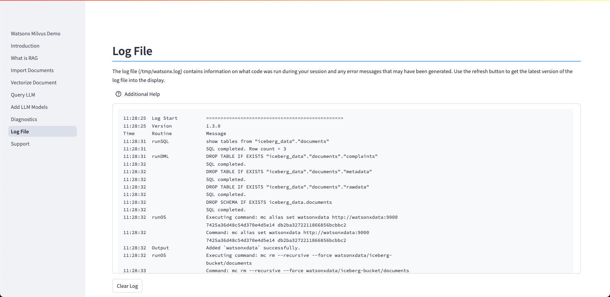

# Log File
The log file (/tmp/watsonx.log) contains information on what code was run during your session and any error messages that may have been generated.

The log file contains details on what code was run within the demonstration system, and it will also contain more detailed error messages that you can use to diagnose any problems in the system. There is a copy to clipboard icon on the top right side of the text display that you can use to download the log file to your system.

Use the ++"Clear Log"++ button to clear the contents of the log. The log display will not be refreshed until the next time you access this dialog.
