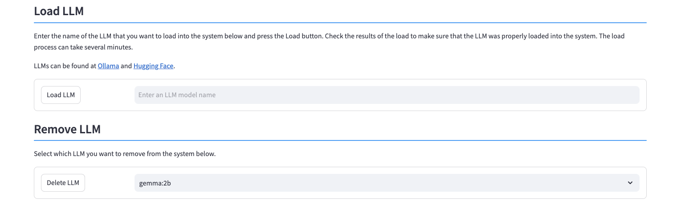

# Managing LLMs

This system has been built using the IBM instructlab/granite-7b-lab model. You can load additional models into the system by using the Add LLM Dialog.

The LLMs that are currently in the system are:

| Name     | Author    | Link
|----------|-----------|------------
gemma:2b|Google|[https://ollama.com/library/gemma2]()
granite3-dense|IBM|[https://ollama.com/library/granite3-dense]()
instructlab/granite-7b-lab|IBM|[https://ollama.com/instructlab/granite-7b-lab]()
instructlab/merlinite-7b-lab|IBM|[https://ollama.com/instructlab/merlinite-7b-lab]()
Ilama3|Meta|[https://ollama.com/library/llama3]()
llama3.2:lb-instruct-q8_0|Meta|[https://ollama.com/library/llama3.2]()
tinyllama:l.lb-chat-vl-q8_0|StatNLP Research Group|[https://ollama.com/library/tinyllama]()
mistral-small|Mistral AI|[https://ollama.com/library/mistral-small]()
phi3.5|Microsoft|[https://ollama.com/library/phi3.5]()
phi3:3.8b-mini-128k-instruct-q8_0|Microsoft|[https://ollama.com/library/phi3]()

Below the list of LLMs are options to add a new LLM or remove one from the system.

## Loading an LLM

LLMs can be found at [Ollama](https://ollama.com/library) and [Hugging Face](https://huggingface.co/models). In order to load the LLM into the system, the LLM must be cataloged in the Ollama library. Doublecheck the licensing requirements of any LLM you choose to download. While most of the LLMs provide an open source license for testing and demonstrations, several of them do not allow for commercial use. 

The following screen shows the results of searching for IBM in the Ollama library.

If we select the granite3-dense model, we are provided with more details on the model.

You must decide which version of the LLM you want to use. The pulldown list on the far left side will provide various versions of the LLM to download.

In this example, we will select the smaller 2Gb version.

The full name of the LLM will be populated in box to the right of the model you selected. There is a copy button beside the name that you can use to copy the LLM name.

Place your cursor into the LLM name field and use the paste key (Windows/Linux ++ctrl+"v"++, Mac ++command+"v"++) to place the value into the field.

The format of the LLM name is not correct as pasted. The front of the LLM name is prefixed with `ollama run` which needs to be removed. The field should only contain the name of the LLM model or `granite3-dense:2b`. Once you have updated the name, press the ++"Load LLM"++ button to begin the load process. 

Usually the load process takes a minute or so to complete since it is downloading gigabytes of data. When the load is done, a success or failure message will be displayed.

You can check that the LLM has loaded by pressing the ++"Refresh List"++ button at the top of the screen.

## Removing an LLM

If you find that an LLM is not suitable for your demonstrations, you can remove it from the system by selecting the name of the LLM from the pull-down list.

If this is the LLM you want to remove, press the ++"Delete LLM"++ button to remove it from the system. The system will provide a success message once the deletion is complete.