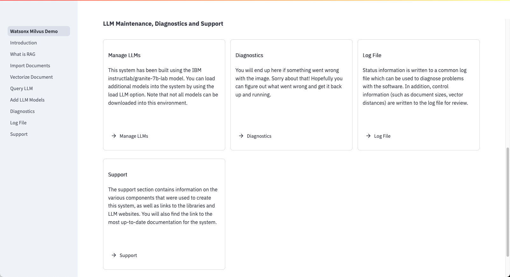

# Main Menu

Your TechZone reservation will contain two URLs that you will use to connect to the demonstration:

The first URL (IBM watsonx.data and Milvus Demo) is the link that will connect you to the demonstration system. The second link (watsonx.data UI) provides access to the watsonx.data UI where you can explore the contents of the watsonx.data environment. There is a section in the Appendix ([watsonxui](./wxd-intro-watsonui.md)) which provides details on how to navigate watsonx.data using the UI.

## Log In 

To access the watsonx.data and Milvus demo, click on the link in your reservation. Note that the server name and port number will be different in your environment.

<code style="color:blue; font-size: 90%;">IBM watsonx.data and Milvus Demonstration: https://na4.services.cloud.techzone.ibm.com:xxxxx</code>

An initial login panel will be displayed:

Enter the userid and password below to access the system.

!!! abstract "Enter the credentials for the watsonx user and press Log in"

    * Username: watsonx
    * Password: watsonx.data

## Subsequent Log In

If you stop using the system for a period of time, the Log In screen will re-appear. You may also see an error message displayed that suggests some components are not available. This error is due to the system restarting but several of the parallel processes not being initialized. If this is the case, use the browser refresh button to restart the process and the error message will disappear.

## Main Menu

The main menu consists of a navigation bar on the left side of the display, and several tiles which provide details and links to the different parts of the application.

The scroll bar is on the far right side of the display. Scrolling down will reveal the remainder of the options available in the demonstration.

The menus are divided into three sections:

* System Overview 
    
    Details on what components make up the system and links to documentation.

* Document Storage, Vectorization, and LLM Queries
  
    The main section of the application revolves around document (URL) storage, vectorizing these documents, and then using an LLM with RAG to answer questions. 

* LLM Maintenance, Diagnostics and Support
  
    If you need to diagnose problems in the system, this section provides several ways of correcting or restarting services. You can also manage which LLM models you use in the environment.

## System Overview

The *System Overview* provides links to documentation and details on how the system has been created.

* Introduction

    This section provides details of what the system is demonstrating. It provides a condensed version of the details that are found in this documentation.

* Retrieval Augmented Generation

    If you are not familiar with the concept of RAG, this panel will provide some details on how it is used with LLMs.

* Documentation Support

    This link will display the documentation which you are currently reading.

## Document Storage, Vectorization, and LLM Queries

The *Document Storage, Vectorization, and LLM Queries* section is the one where you will spend most of your time in the demonstration. 

* Import Documents

    In order to generate RAG prompts, the system must have documents that it can extract sentences from. The system provides an interface that allows you to load documents from your local machine, URLs from a website, or documents that are selected from Wikipedia. A default document (IBM 2023 earnings summary) is provided for you to test with. These documents are registered and stored within the watsonx.data environment.

* Vectorize Documents

    In order to use RAG prompts, documents need to be vectorized into the Milvus database. Based on the question being asked, a RAG prompt will be generated from the sentence vectors that are found in the Milvus database. 

* Query LLM

    Once at least one document collection has been created, you can ask an LLM a question and use RAG generation to provide more details to the LLM. You can select which document collection to use, the setting to use for generating the RAG prompt, and which LLM to use to answer the question.

## LLM Maintenance, Diagnostics and Support

The *LLM Maintenance, Diagnostics and Support* section provides help for situations where the system is not working. 

* Manage LLMs

    Several LLMs (instructlab/granite-7b-lab) are provided in the system. You can add a new LLM to the system or remove ones that you are not using. 

* Diagnostics

    The diagnostics panel provides several options for checking the operation of the system. You can restart many of the services and reset the database from scratch if you believe that it has been corrupted.

* Log File

    The program will log many of the operations that are performed by the system. If you come across an error during use of the system, the log file many provide some guidance on what went wrong.

* Support

    Links to the various components used in the system are provided in this panel.

