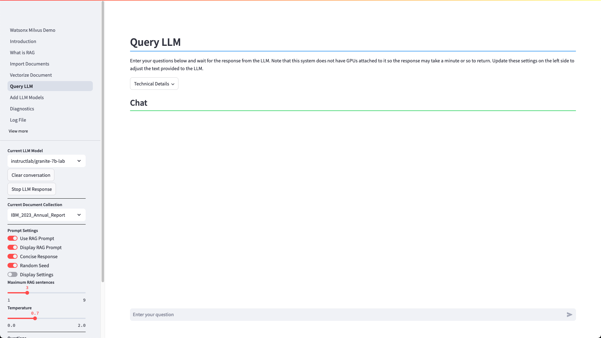
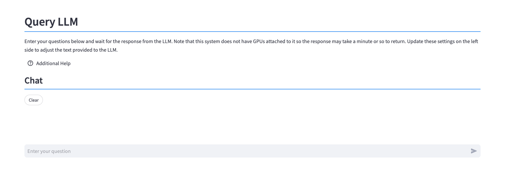
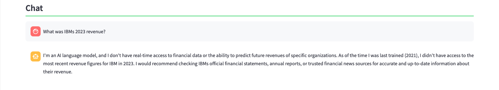
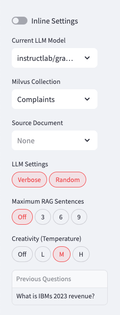
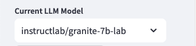
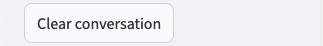
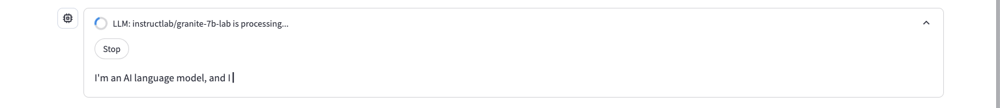
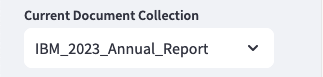
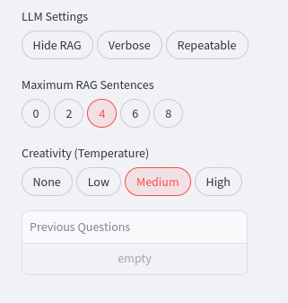
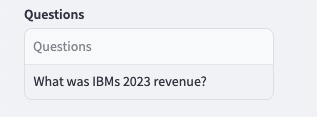

# Query LLM

The Query LLM panel is used to ask questions of the LLM.

The central part of the screen contains the chat window.

The question that you want to ask the LLM is placed into the text box at the bottom of the screen, press ++enter++, and the response will be placed into the chat window underneath your question.

!!! warning "System performance is limited by the lack of GPUs"

    Note that this system does not have GPUs attached to it so the response may take a minute or so to return. The initial question will load the LLM into memory which will result in a delay in answering the question. Subsequent questions will usually be answered faster.

    When you switch LLMs, the new LLM will need to be loaded into memory. Take this into account when you are demoing different LLMs.

The left side of the screen contains options that will change the behavior of the LLM.

These options are discussed in the sections below.

## LLM Options

### Current LLM Model

The LLM table provides a list of LLMs that are currently loaded into the system. 

Choose which LLM you want to use to answer your query. The default LLM is the Instructlab/granite-7b-lab model. If you want to add more LLMs to the system, use the Add LLM model dialog.

Use the ++"Clear conversation"++ button to clear the history of questions and LLM responses. 

If you find that the LLM is taking too long to respond (or saying too much), press the ++"Stop LLM Response"++ button.

Note that stopping the LLM will clear the last response on the screen.

### Current Document Collections
The list of collections that have been vectorized are found in this table. 

Select which collection you want to use when generating the RAG prompt. Make sure that you are using a document collection that matches the question you are asking the LLM!

### Prompt Settings

The Prompt Settings determine how the RAG prompt gets generated when querying the LLM.

#### Use RAG Prompt

The Use RAG prompt option will tell the program to generate a RAG response. 
If this is turned off, the question is sent "as is" to the LLM. This provides an opportunity to see what the LLM answer will be without a RAG prompt. Turning on the RAG prompt and then asking the same question will demonstrate how the RAG prompt can help the LLM generate a better answer. 

#### Display RAG Prompt

The Display RAG prompt option will include the complete RAG prompt on the screen. If you want to hide the RAG prompt, turn the Display RAG prompt off.

#### Concise Response

The Concise response option will tell the LLM to limit the answer to your question. If you turn Concise output off, the LLM will be allowed to answer your question without length restrictions. The trade-off when turning off the concise option is the amount of time it takes to return the full output from the LLM. 

#### Maximum RAG Sentences

The Minimum RAG Sentences slider is used to limit the number of sentences that the RAG program will use in the question. The default number of sentences is 3. Using a larger number of sentences will slow down the LLM response, but it may result in a higher quality answer.

### Questions

The left sidebar includes a list of questions previously sent to the LLM.

To copy a question into the LLM prompt, use the following steps:

1. Click on the question you want to copy from the list (it will be highlighted)
2. Use the keyboard copy button (Windows/Linux ++ctrl+"c"++, Mac ++command+"c"++) to place the value onto the clipboard
3. Click on the LLM question input line
4. Use keyboard paste button (Windows/Linux ++ctrl+"v"++, Mac ++command+"v"++) to place the copied value into the line

## Technical Details

The process which takes place when you enter a question is:

* The question is turned into a vector value
* The value is compared to the sentence vectors that were generated in the Vectorize Document step (Document collection)
* The 3 best sentences (or whatever you may have set the sentence limit to) will be used to generate a RAG prompt
* The RAG prompt is sent to the LLM
* The program displays the results as they are generated by the LLM

If you want to view the Milvus vector distance for the RAG prompts, view the LOG file output.