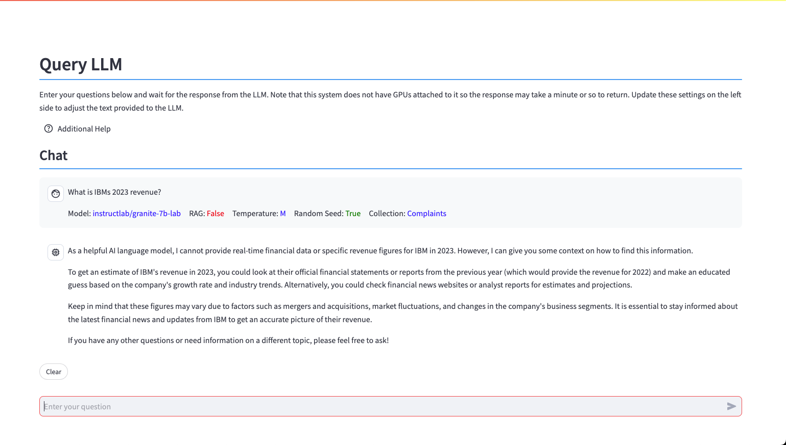

# Query LLM

The Query LLM panel is used to ask questions of the LLM.

The central part of the screen contains the chat window.

The question that you want to ask the LLM is placed into the text box at the bottom of the screen. Press ++enter++, and the response will be placed into the chat window underneath your question.

The bottom of the question will include the settings that were used when querying the LLM. 

The ++"Clear"++ button will clear all the questions and replies from the screen.

While the LLM is answering the question, a ++"Stop"++ button will be displayed.

If you find that the LLM is taking too long to respond (or saying too much), press the stop button. Stopping the LLM will clear the last response on the screen.

!!! info "System performance is limited by the lack of GPUs"

    Note that this system does not have GPUs attached to it so the response may take a minute or so to return. The initial question will load the LLM into memory which will result in a delay in answering the question. Subsequent questions will usually be answered faster.

    When you switch LLMs, the new LLM will need to be loaded into memory. Take this into account when you are demoing different LLMs.

The left side of the screen contains options that will change the behavior of the LLM.

These options are discussed in the sections below.

## LLM Options

The various options used by the system can be found in the sidebar, or above the question line.

When an option is selected, it will be filled in with a light red background, or just plain white if turned off.

In this example, the "Verbose" setting is on, and the "Random" setting is off. The Maximum RAG Sentences and Creativity control only permit one value at a time. 

### Settings Orientation

The LLM options can be displayed on the sidebar (as shown previously) or inline with the LLM questions. 

Turning this setting ON will result in the options being listed above the question input line. 

The buttons replace the ones that were in the sidebar, except for the previous query list. You can move the buttons back to the sidebar by turning off the option.

### Current LLM Model

The LLM table provides a list of LLMs that are currently loaded into the system. The value that is listed will be the one that is used for your query.

Choose which LLM you want to use to answer your query. The default LLM is the Instructlab/granite-7b-lab model. If you want to add more LLMs to the system, use the Add LLM model dialog.

!!! info "Changing LLM Models"
    Changing the LLM model will result in the current LLM being removed from memory and the new one being load in. This process will cause the LLM to take longer than normal to answer your question. However, once the LLM is loaded, the results should be generated at a fast rate.
    
### Milvus Collection
The list of collections that have been vectorized are found in this table. 

Select which collection you want to use when generating the RAG prompt. Make sure that you are using a document collection that matches the question you are asking the LLM!

### Source Document
The system provides an option for you to supply the LLM with an entire document, rather than generate a RAG prompt. This option lists all the documents (**not collections**) found in the system. When a document is selected, the RAG prompt is disabled automatically, and the document is provided to the LLM to answer the question.

For instance, the default document in the system is the IBM 2023 earnings report. By selecting this document, the LLM will be provided with this document to answer your question. Alternatively, you can keep this setting as None, and then generate a RAG prompt using the same document. 

Providing the original document to the LLM will result in a much longer period of time before an answer is generated. Using RAG prompts will typically run much faster. 

Using entire documents is recommended for:

* Summarization of a document
* Providing context for generating a new document or presentation
* Situations where RAG responses do not provide enough context

Be aware that the lack of a GPU in this system will result in long processing times.

### LLM Settings

There are several options in the system that control the behavior of the LLM.

When an option is selected, it will be highlighted in red.

#### Verbose

The default setting (Verbose **ON**) will display the RAG prompt that is generated. Turn this option **OFF** is you want to prevent the RAG prompt from displaying on the screen. You may want to turn the VERSE display **OFF** if you are demonstrating how a RAG prompt works.

#### Random

The LLM is provided with a random seed whenever a question is asked (Random **ON**). When a random number is used, the answer to the same question may vary between runs. If you turn **OFF** the Random setting, the LLM will be provided with the same random number (42 - Ask the LLM what that number means!). In most cases, the answer will be the same between runs.

#### Verbose

The system will generate a RAG prompt that tells the LLM to provide a concise response. If you select a Verbose Reply, the LLM will be allowed to answer your question without length restrictions. The trade-off when turning off the concise option is the amount of time it takes to return the full output from the LLM.  

#### Random

The LLM is provided with a random seed whenever a question is asked. When a random number is used, the answer to the same question may vary between runs. If you select the Repeatable option, the LLM will be provided with the same random number (42 - Ask the LLM what that number means!). In most cases, the answer will be the same between runs.

#### Maximum RAG Sentences

The Maximum RAG Sentences setting is used to limit the number of sentences that the RAG program will use in the question. The default number of sentences is 3. Using a larger number of sentences will slow down the LLM response, but it may result in a higher quality answer. Setting the value to Off will stop any RAG generation.

#### Creativity (Temperature)

The Creativity (Temperature) setting determines how the LLM will answer the question. The possible values are Off (0), Low (0.3), Medium (0.7), and High (1.5), with Medium being the default value. Use a lower temperature value when you want more dependable output. Use a higher temperature value when you want to increase the randomness and variability or the output, such as when you want creative output. Remember, randomness can also lead to inaccurate or nonsensical output.

#### Questions

The left sidebar includes a list of questions previously sent to the LLM.

To copy a question into the LLM prompt, use the following steps:

1. Click on the question you want to copy from the list (it will be highlighted)
2. Use the keyboard copy button (Windows/Linux ++ctrl+"c"++, Mac ++command+"c"++) to place the value onto the clipboard
3. Click on the LLM question input line
4. Use keyboard paste button (Windows/Linux ++ctrl+"v"++, Mac ++command+"v"++) to place the copied value into the line

#### Clear and Stop
The bottom of the LLM Chat window will have a Clear button. This button will clear the history of questions and LLM responses. 

The LLM window will display a Stop button while the LLM is answering a question. If you find hat the LLM is taking too long to respond (or saying too much), press the Stop LLM button. Note that stopping the LLM will clear the response on the screen.

## Technical Details

### Application Logic

The process which takes place when you enter a question is:

* If RAG is ON and Document is None
    * The question is turned into a vector value
    * The value is compared to the sentence vectors that were generated in the current collection
    * The 3/6/9 best sentences will be used to generate a RAG prompt
    * The RAG prompt is sent to the LLM
* If RAG Is OFF or a Document is selected
    * If a document exists, it is provided to the LLM
    * The question is sent to the LLM
* The program displays the results as they are generated by the LLM

!!! info "No GPUs"
    Note that this system does not have GPUs available to it. This means that the response from the LLM could be in the order of minutes, so you will need some patience! If you think you have seen enough output, press the STOP button.

### RAG Sentence Selection

The settings that were used during the last question are displayed below the question sent to the LLM.

At the bottom of the question you will see settings along with a distance value (0.64 in this example).

The distance value represents a similarity (distance) measure between the question that was asked, and the text found in the collection. The distance values that approach zero represent the sentences that are closest to the question. The distance value in the result represents the smallest distance measure for the sentences selected from the collection.
