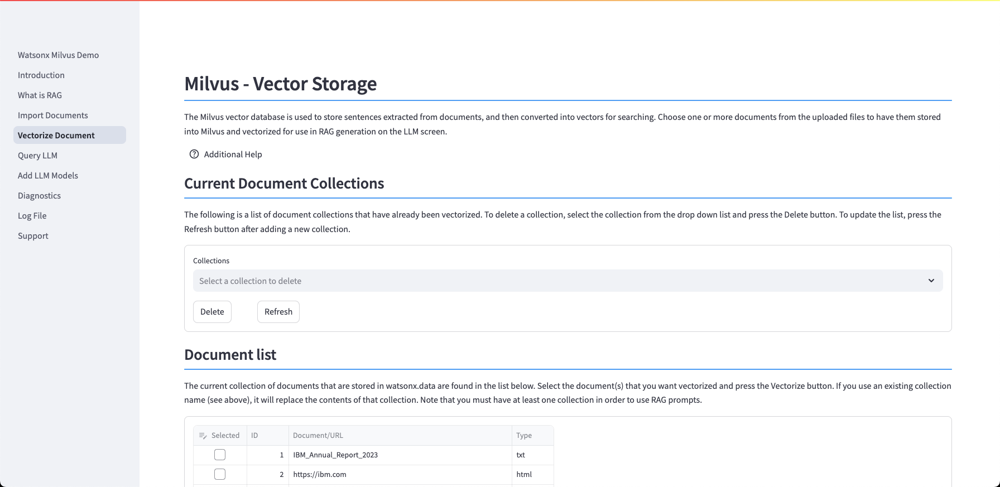
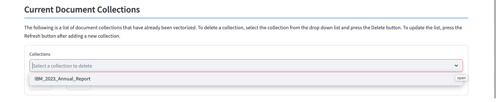
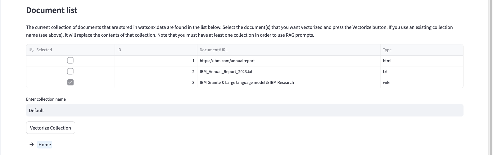
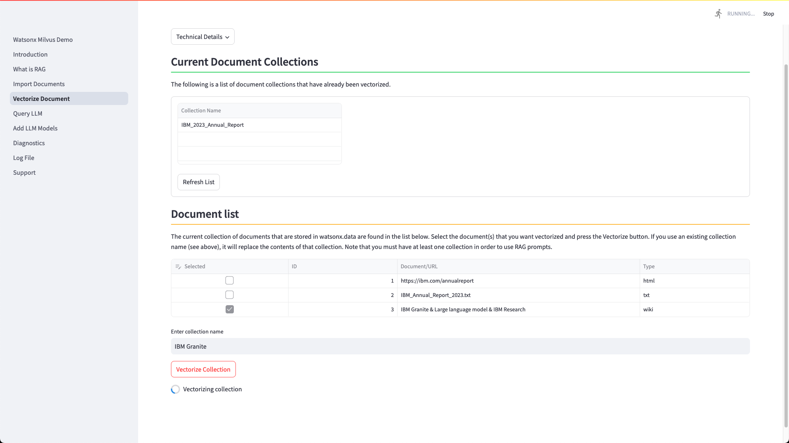

# Vectorize Documents

Milvus is a vector database that stores, indexes, and manages massive embedding vectors that are developed by deep neural networks and other machine learning (ML) models. It is developed to empower embedding similarity search and AI applications. Milvus makes unstructured data search more accessible and consistent across various environments.

The watsonx.data system that you are running includes the Milvus server. The Milvus vector database is used to store sentences extracted from documents, and then convert them into vectors for searching. 

## Vectorize Documents

The Vectorize panel displays the list of document collections, the documents stored in the watsonx.data system, and an option to vectorize one or more documents. 

### Current Document Collections

A document collection is made up of a series of documents that have been vectorized. 

In the screen above, only one collection (IBM_2023_Annual_Report) is currently loaded into the system. If you decide to generate a RAG prompt when querying an LLM, you must specify this document collection. 

A document collection is made up of a one or more documents (or URLs) that are transformed into vectors and stored in Milvus. When querying an LLM, the Milvus vector database will search the document collection for sentences to use as part of the RAG generation. 

To delete a document collection, select a collection from the list and press the ++"Delete"++ button. If you create a new collection, it will not be visible in this list until you press the ++"Refresh"++ button.

### Document List

The document list contains all the documents and URLs that have been registered in the system.

One or more documents make up a collection. Select the documents that you want to be included in a collection, and they will be vectorized as a group in Milvus. Provide a unique name for your collection and then press the Vectorize Collection button.

!!! abstract "Document Collections"

    You can include as many documents, URLs, or Wiki documents in your document collection. The documents will be combined and stored as vectors in the Milvus database. The only criteria for your documents is that the topics covered by your documents should be the same. 

If you use the name of an existing collection, the contents of that collection will be overwritten with the new documents.

There are three options for the vector size to be used when creating a collection: Small, Medium, and Large. These values translate to 512, 1024, and 2048 tokens. A token is roughly equivalent to a word, but it doesn't always map 1 for 1. The default value is Small (512) and is highlight in light red.

Using larger token values will result in larger RAG sentences being used. This will improve the amount of data and accuracy (less missing text) that the LLM will be able to use in providing an answer to your question. Small token amount may result in sentences being cut off during processing. The user must balance the response time of the LLM versus the accuracy of the data.

Once you press the ++"Vectorize Collection"++ button, the documents will be converted into vectors and stored in Milvus. This process may take a few minutes to complete depending on the size of the documents.

The collection will now be available for your RAG generation step.

#### Vectorization Errors

If you receive an error message during the vectorize step, you may need to load a conversion library in order for the text to be extracted from the document. 

In this example, we tried to vectorize a Microsoft Word file with an extension of `.DOCX`. 

Details on how to fix this error can be found in the [Diagnostics](./wxd-demo-diagnostics.md#add-library) section. 

Note: Microsoft formats (DOC, PPT, XLS) are supported by default.

## Technical Details

In order to create a RAG (Retrieval Augmented Generation), one or more documents must be selected from the database, the text
extracted, and then stored into Milvus and vectorized.

The process to vectorize a document involves converting the document (PPT, PDF, etc...) into RAW text. Once the text is available, the text is split into smaller chunks, with each chunk containing 512 or so tokens. A token is loosely compared to a word. These chunks are stored in the Milvus database and the text is vectorized using an algorithm (sentence-transformers/all-MiniLM-L6-v2).

Once the vectorization is completed, we can search the data for similar sentences when generating a RAG prompt.

The LLM can run without using a document collection, but it will not be able to generate a RAG prompt. 