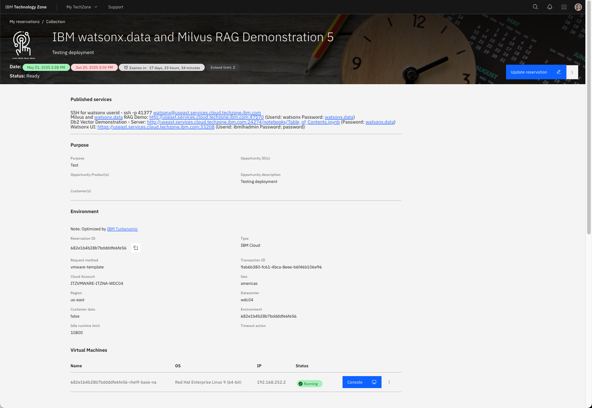

# Library Issue

The current system has an issue with a library that is automatically updated during TechZone deployment. This error will result in the UI failing. The UI will look similar to the following in your browser:


Click on the **View My Reservations** to access your reservations.


Click on the reservation that corresponds to the watsonx.data reservation. The menu button that is beside the arrow provides options to extend or delete the reservation.


When you click on reservation details option, or the Open this Environment box, the browser will display the details of your image.



Scroll down the page until you see the VM Console button.


Click on the blue Console button to see the login screen of the server open in a separate browser tab. Select the watsonx user.


The password for the `watsonx` user is `watsonx.data`.

When you login you will see a screen similar to the following.


Select the terminal window icon highlight in red above. A terminal window will be displayed.


Type following command into the terminal window (you cannot easily cut and paste into this window) and hit Return/Enter to execute it. If you are prompted for a password, use `watsonx.data`.

```
sudo systemctl stop streamlit
```

Once the command completes, issue the following command.

```
sudo systemctl start streamlit
```

To check that everything is running, issue the following command.

```
sudo systemctl status streamlit
```


Your system should now work properly after these commands. 


