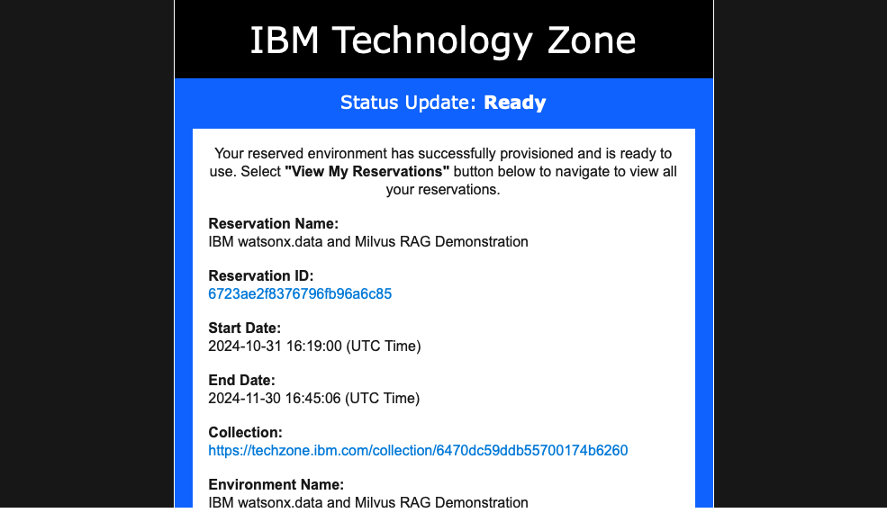
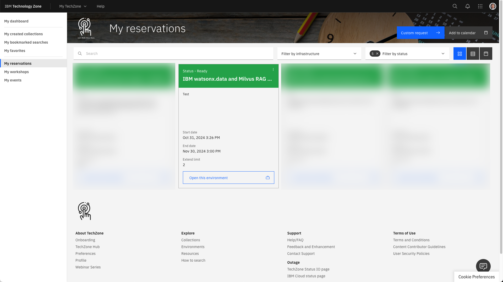
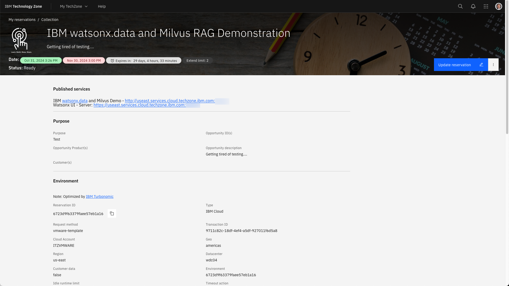

# Accessing the watsonx.data TechZone Image

The reservation email from TechZone is extremely important since it provides a link to your reservation. 

Click on the **View My Reservations** to access your reservations.

Click on the reservation that corresponds to the watsonx.data reservation. The menu button that is beside the arrow provides options to extend or delete the reservation.

When you click on reservation details option, or the Open this Environment box, the browser will display the details of your image.

The top of the reservation will display two URLs which will be used to access the demonstration system. The first link is used to access the demo program, while the second is used to access the watsonx.data console. Details on how to use these are found in the next section.

## Passwords

This table lists the passwords for the services in the system.

|Service|Userid|Password
|-------|------|--------|
|Virtual Machine|watsonx|watsonx.data
|watsonx.data UI|ibmlhadmin|password
|Demonstration UI|watsonx|watsonx.data