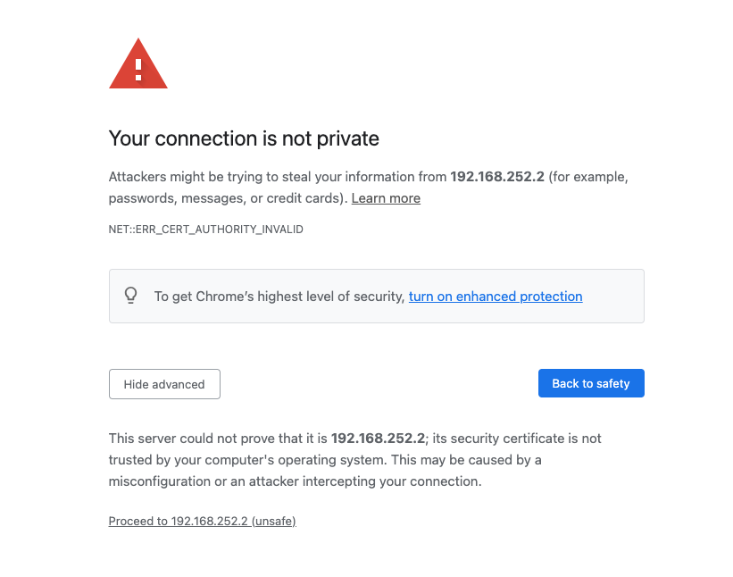

# Watsonx.data and Demonstration Ports

The top of your TechZone reservation will contain two published services at the top of the details page.


These URLs and Port numbers are needed to access the demo. The list will contain the following information: 

* IBM watsonx.data and Milvus Demo: http://region.services.cloud.techzone.ibm.com:33333
* Watsonx UI: https://region.services.cloud.techzone.ibm.com:41311

The server URL will be different for each region and data center that your machine is provisioned on. The server name is usually in the format:
```bash
region.services.cloud.techzone.ibm.com:port
```
The `port` number that is provided in the reservation is mapped to the proper port number in the server. 

These links may result in a Certificate error in Firefox. Follow these steps to ignore the error when accessing these URLs.


 
Select Advanced.


 
Choose "Accept the Risk and Continue". If you are using Google Chrome, you can bypass the error message by typing in "thisisunsafe" or clicking on the "Proceed to 192.168.252.2 (unsafe)" link.

